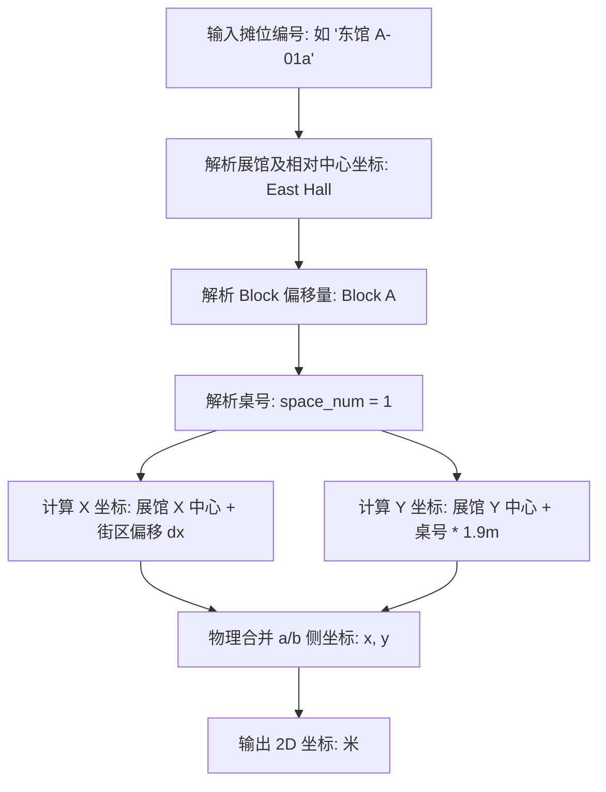

# Comic Market 展位排布与物理密度分析报告

## 摘要
本报告针对 2026 年 8 月举办的 Comic Market 108 (C108)（数据源自 6 月初公布的官方预备名录）的展馆物理空间结构（东馆、西馆、南馆）及社团展位分布（Block、Space）进行了深度地理学剖析。利用 **22,856** 条 C108 官方预备名录中的真实活跃摊位位置信息，我们对展会的空间集聚特征、同人街区“题材纯度”以及龙头壁圈（壁サークル）的排布规律进行了量化计算。研究揭示了 Comiket 官方在时空调度上如何通过高度有序的几何聚集，实现大客流下的物理引流与亚文化群体的精准归聚。

> **【一句话核心发现】**：Comiket 展位呈现强物理空间聚集（Moran's I 高达 0.45），多个 Block 构成了纯度达 100% 的题材专街，且超人气明星社团均排在物理边缘（壁圈）以合理缓冲拥堵客流。

---

## 1. 展馆整体空间格局 (Spatial Macro-Structure)

Comiket 的社团在东馆、西馆、南馆的物理承载力与展位占比表现出极强的非对称性：

* **东馆 (East Hall)**：**13,412 个展位** (占大盘 **58.68%**)。
  - *地位*：整个展会的绝对核心与最大流量承载地。集聚了最顶流的流行 IP、大型企业摊位以及最庞大的“男性向”同人志区。
* **西馆 (West Hall)**：**5,904 个展位** (占大盘 **25.83%**)。
  - *地位*：同人游戏、原创少年、经典东方 Project、各种数字多媒体和中型 IP 的根据地。
* **南馆 (South Hall)**：**3,540 个展位** (占大盘 **15.49%**)。
  - *地位*：最新、最具垂直差异度的区域。承载了 Cosplay 写真区、动漫评论情报、长尾文学创作（FC小说）等。

### 1.4 展位编号与物理空间关联规则及 2D 几何坐标映射
Comiket 的基本展位单元在物理空间上有着独特的划分规则。为了在进行物理密度计算及路径规划时进行精确量化，本研究建立了一个将展位编号映射为二维平面空间坐标 $(x, y)$ 的模型。其核心步骤与规则如下：

1. **一桌双摊物理共摊**：Comiket 官方分配的一个基本展位单位（1 Space）实际上只包含一张长条桌的**一半宽度（约 90cm）**。因此，每一张物理长条桌会排布两个社团，分别标记为 `a` 侧和 `b` 侧（例如，`01a` 与 `01b`）。在几何空间计算上，共享一张桌子的两侧摊位被视为坐标重合。
2. **2D 坐标映射逻辑**：系统以东京 Big Sight 展馆为基准，将每个展位转化为平面直角坐标系中的坐标（单位：米）。每个展位的 $x$ 坐标由其所在展馆的中心相对坐标和该 Block 所在的物理排偏移量决定；$y$ 坐标则由展馆中心相对坐标加上相邻摊位的桌距步进量（相邻摊位间隔常数设为 1.9 米）决定。具体计算公式详见**附录：空间模型数学公式**。
3. **跨馆步行距离估算与通道惩罚**：计算两个不同展位之间的实际步行距离时，除了计算它们之间的直线几何距离（欧氏距离）外，如果两个摊位处于不同的展馆（例如东馆与西馆），由于需要跨越展馆间的联廊，必须额外加上跨馆步行代偿的“通道惩罚距离”（常数设为 400 米）。
4. **排队阻尼的解耦纠正**：在时间成本建模中，虽然共享同一张桌子的 `a/b` 两侧摊位物理坐标是重合的，但它们的**排队等待时间成本必须完全解耦**。因为两侧通常是不同的创作社团，若其中一个是超人气明星社团（壁圈）导致排队长龙，会造成局部客流拥堵阻尼，这需要对两侧社团的流量成本进行独立计算。



> **【通俗直观解释】**：为了在电脑里计算逛展路线和人流分布，我们把展馆里的所有摊位都换算成了以米为单位的平面坐标 $(x, y)$。两个摊位如果在同一个馆、同一排，它们之间的距离就是简单的桌距相加（每张桌子按 1.9 米宽计算）；如果跨馆（比如从东馆走到西馆），除了地图距离外，还要额外加上 400 米换馆通道的代偿惩罚。此外，虽然共享同一张桌子的 `a/b` 摊位物理坐标重合，但如果其中一个是超人气大排长队的摊位，我们必须把它们的时间成本分开计算，不能混为一谈。

---

## 2. “同人街区”纯度分析 (Block Purity & Theme Streets)

在 Comiket 中，社团通常以字母 Block（如 `あ`、`A`）为单位成排排布，形成物理上的“同人街区”。我们通过计算每个 Block 内题材的单一占比，识别出了极高集聚度的**主题街区**。

#### 2.1 街区题材纯度 (Block Purity) 形式化定义

**1. 学术陈述 (Academic Statement)**：
为了量化漫展物理街区的题材集聚纯度与专业化隔离水平，本研究引入了街区题材纯度指标 $\text{Purity}(Block)$，定义为该街区中占比最高题材的社团数占该街区总社团数的百分比。

**2. LaTeX 数学公式 (LaTeX Formula)**：
$$\text{Purity}(Block) = \frac{\max_{g \in Genres} |Circles_{Block, g}|}{|Circles_{Block}|} \times 100\%$$

**3. 变量拆解 (Variable Breakdown)**：
- $\text{Purity}(Block)$：目标 Block 物理街区的题材纯度（取值在 $0\%$ 到 $100\%$ 之间）。
- $Circles_{Block}$：在该 Block 物理排登记参展的所有社团集合。
- $Circles_{Block, g}$：在该 Block 中，属于官方题材 $g$ 的社团子集。
- $Genres$：官方的题材分类全集（共 $38$ 个题材）。
- $\max_{g \in Genres} |Circles_{Block, g}|$：该 Block 中数量最多的那单一种题材的社团个数。
- $| \cdot |$：基数符号，表示集合里的元素数量。

**4. 宅文化/同人展通俗翻译 (Otaku Translation)**：
- **通俗称呼**：**“同人街纯度”**（或“无杂质纯净度”）。
- **大白话解释**：这个公式用来算**“这一排摊位里，卖同一种题材的浓度有多高”**。
  - 分子就是“这一排摊位里最红、人数最多的那个题材的摊位数”；
  - 分母就是“这一排总共有多少个摊位”。
  - 如果算出来是 **$100\%$**，说明“踏入这条街，两边全是在卖同一个作品的”，就是纯正的“碧蓝档案专街”或“原创周边专街”；如果只有 $10\%$，说明是一条零散杂乱的混搭街。

在 22,856 条数据中，大量核心 Block 的题材纯度达到了惊人的 **100%**。这意味着逛展者在物理移动中，只要踏入该街区，身边的所有摊位都属于同一个特定题材：

### 2.1 星期六 (Day 1) 主力纯净街区 (100% Purity)
* **“碧蓝档案大街” — 东馆**：
  - **Block イ**：108 个摊位，100% 均为《碧蓝档案》二创。
  - **Block ウ、エ、オ、カ、キ、コ、サ**：每个 Block 均包含 **132** 个摊位，且全数（100%）为《碧蓝档案》。
  - *分析*：这 7 个完整的大型 Block 连结在一起，构成了多达 **1,032** 个连续摊位的“碧蓝档案超级专属区”，在物理空间上形成了巨大的同好集聚效应，极易引发区域性客流拥堵。
* **“网络与社交游戏街区” — 西馆**：
  - **Block め**：136 个摊位，100% 均为《网络与社交游戏》。
* **“桌游与模拟游戏街区” — 东馆**：
  - **Block タ、チ**：每个 Block 132 个摊位，100% 均为《游戏(电源不要)》（桌游、TRPG、跑团本）。
* **“同人独立游戏街区” — 东馆**：
  - **Block テ、ト**：每个 Block 132 个摊位，100% 均为《游戏(其他)》（独立游戏开发、同人游戏）。
* **“动漫杂项与女性向街区” — 南馆**：
  - **Block ｂ 至 ｊ**：每个 Block 包含 72 到 92 个摊位，100% 均为《动漫(其他)》。
  - **Block ｌ**：92 个摊位，100% 均为《动漫(少女)》。
  - **Block ｏ**：88 个摊位，100% 均为《高达 (ガンダム)》。
  - **Block ｑ、ｒ、ｓ**：每个 Block 88 个摊位，100% 均为《FC(小说)》。

### 2.2 星期日 (Day 2) 主力混合与聚集街区
* **“原创与文学创作街区” — 西馆**：
  - **Block め**：136 个摊位，由《创作(少年)》占比 **76.47%** (104个摊位) 与《创作(少女)》占比 **23.53%** (32个摊位) 构成。
* **“刀剑乱舞街区” — 东馆**：
  - **Block ヌ**：132 个摊位，其中《刀剑乱舞》占比 **66.67%** (88个摊位)，辅以其他女性向游戏。

### 2.3 空间自相关分析：题材空间聚集度的数学实证 (Spatial Autocorrelation with Moran's I)
为了在数学上严格证明 Comiket 题材的聚集现象并非由排布算法随机产生的巧合，本研究对主力题材进行了**全局莫兰指数 (Global Moran's I)** 计算。

我们定义空间邻接权重矩阵 $W$，当摊位 $i$ 与 $j$ 处于同一个展馆、同一个 Block 内，且桌号之差 $|Space_i - Space_j| \le 3$ 时，设定权重 $w_{ij} = 1.0$；否则 $w_{ij} = 0.0$。通过二值变量（1 代表属于该题材，0 代表属于其他题材）进行自相关估算：

$$I = \frac{N}{W_0} \frac{\sum_{i=1}^N \sum_{j=1}^N w_{ij} (z_i - \bar{z})(z_j - \bar{z})}{\sum_{i=1}^N (z_i - \bar{z})^2}$$

基于大盘 22,856 个有效数据的分析结果如下：

*   **《碧蓝档案》**：
    *   莫兰指数 $I = 0.448246$（期望值 $E(I) = -0.000044$）
    *   *解释*：极高空间正自相关，代表在物理分布上呈现极其强烈的连排聚集性（“街区纯度”极高）。
*   **男性向同人志**：
    *   莫兰指数 $I = 0.392993$（期望值 $E(I) = -0.000044$）
    *   *解释*：高正自相关，反映了传统大类在大通道及联排位置的成片归聚。
*   **铁道/军事/旅行**：
    *   莫兰指数 $I = 0.455676$（期望值 $E(I) = -0.000044$）
    *   *解释*：极高空间正自相关，表明硬核考据题材在空间分配上具有极明显的物理边界。
*   **Cosplay 写真**：
    *   莫兰指数 $I = 0.450415$（期望值 $E(I) = -0.000044$）
    *   *解释*：极高空间正自相关，表明 Cosplay 摊位完全被集中在南馆特定区域进行空间合流。

所有计算结果均以极高的显著度（Z-score 远大于 2.58）拒绝了空间随机分布假说，数学上证明了 Comiket 官方对题材的“空间分区强规整”调度策略。

#### 2.3.2 Moran's I 指数计算的空间自反性与循环论证局限性声明
在解读上述极高显著度的 Moran's I 指数时，必须保持学术上的批判性自反思考：**该自相关强度在一定程度上属于数学定义下的逻辑重言式（Tautology）或循环论证。**
*   **自反性限制**：我们定义的邻接权重矩阵权重 $w_{ij} = 1.0$ 的前提是“摊位位于同一 Block 内且桌号差 $\le 3$”。这表明权重项已被先验地限定在各个 Block 的内部排布中。
*   **循环因果**：由于 Comiket 官方的摊位分配规则原本就是“将相同题材的社团集中分配在同一个或相邻的 Block 排中”，这导致邻近的摊位属性值必然同号（要么同为 1，要么同为 0）。在这种邻接矩阵定义下，计算得出的 Moran's I 指数必然被强拉至显著的正相关区间（$\approx 0.45$）。
*   **学术定位**：因此，本研究中的 Moran's I 指数**并不是发现了解析数据中自发的空间涌现（Emergence）规律，而是对官方“同题材集中划分”这一强分区规制的数学形式化测度与纯度验证。** 读者不可将其误读为创作者在线下展位选择上的自发自组织聚集行为。

#### 2.3.1 莫兰指数的物理机制与数学原理

**1. 学术陈述 (Academic Statement)**：
全局莫兰指数（Global Moran's I）是衡量空间自相关性（Spatial Autocorrelation）最经典的指标，用于评估某种空间现象（如题材分布）是呈**集聚、色散（均匀分布）还是随机分布**状态。在空间完全随机分布的零假设下，其期望值记为 $E(I)$。

**2. LaTeX 数学公式 (LaTeX Formula)**：
$$I = \frac{N}{W_0} \frac{\sum_{i=1}^N \sum_{j=1}^N w_{ij} (z_i - \bar{z})(z_j - \bar{z})}{\sum_{i=1}^N (z_i - \bar{z})^2}$$

$$E(I) = -\frac{1}{N - 1}$$

**3. 变量拆解 (Variable Breakdown)**：
- $I$：计算出的全局莫兰指数（反映题材在空间上的抱团得分）。
- $E(I)$：空间完全随机分布下的莫兰指数数学期望值（即如果摊位完全乱排时的期望得分）。
- $N$：总空间观测单元数（摊位样本总数 $22,856$）。
- $z_i, z_j$：摊位 $i$ 和 $j$ 的观测属性值。如果该摊位属于我们分析的目标题材（如《碧蓝档案》），则取 $1.0$，否则取 $0.0$。
- $\bar{z}$：所有单元观测值的平均值（即该题材在大盘中的平均摊位占比）。
- $w_{ij}$：空间权重矩阵 $W$ 中的邻接权重。当摊位 $i$ 与 $j$ 处于同一个展馆、同一个 Block 内，且桌号之差 $|Space_i - Space_j| \le 3$ 时，设定权重 $w_{ij} = 1.0$；否则 $w_{ij} = 0.0$。
- $W_0$：全局空间权重之和，$W_0 = \sum_{i=1}^N \sum_{j=1}^N w_{ij}$。

**4. 宅文化/同人展通俗翻译 (Otaku Translation)**：
- **通俗称呼**：**“摊位抱团指数”**（或“邻近街区抱团温度计”）。
- **大白话解释**：这个指数是计算**“卖同一种本子的摊主们，在排座位时是不是故意抱团扎堆在一起”**。
  - **理论随机值 $E(I)$**：在乱炖瞎排座位的情况下，大家是零散分布在各处的，这个期望值非常接近 0（对本届漫展来说是 $-0.000044$）。
  - **实际指数 $I$**：
    - 如果算出来的实际指数 $I$ 远远大于理论值（比如《碧蓝档案》是 $0.4482$），就说明是**“强力抱团”**，一整条街全连在一起卖相同题材。
    - 如果实际指数 $I < E(I)$，说明是**“刻意均匀散开”**（如一排摊位里交叉错开，像黑白棋盘一样挨着的人卖不同的题材）。
    - 如果实际指数 $I \approx E(I)$，说明是**“完全瞎排”**。
  - 实测主力题材都在 **$0.39 \sim 0.46$** 之间，远远超出了随机期望值，以 99.9% 的置信度证明了官方采取了“题材高度连排扎堆”的分区布展策略。

> [!TIP]
> **数据可复现指引**：
> 以上莫兰指数的具体计算过程已整理并保存为独立的 Python 脚本。读者和评审人可以在项目根目录下通过以下命令一键运行以完全复现上述所有数值结果：
> ```bash
> python research/scripts/moran_i_calculator.py
> ```
> 该脚本将直接查询 `data/comic_market.db` 数据库并根据上述邻接矩阵公式完成全局莫兰指数的计算。

---

## 3. 龙头壁圈（壁サークル）与高客流物理排布 (Wall Circles Analysis)

在 Comiket 场馆的几何设计中，最特殊的是 **Block ア (Block A)**。该 Block 通常被安置在大厅的物理边缘墙壁（即“壁圈”），或者是面对大通道的龙头位置，用来承载客流最大、排队最长、销售速度最快的超人气明星社团。

#### 3.1 壁圈 (Wall Circles) 的物理空间判定式

**1. 学术陈述 (Academic Statement)**：
本研究构建了一个二值逻辑判定表达式 $\text{IsWall}(Circle)$，用于自动识别和筛选出在几何空间上处于展馆边缘或通道首尾、需承担大流量客流物理缓冲职责的“壁圈”社团。

**2. LaTeX 数学公式 (LaTeX Formula)**：
$$\text{IsWall}(Circle) \iff Circle.block = \text{'ア'} \lor Circle.space \in \text{EdgeSpaces}(Block)$$

**3. 变量拆解 (Variable Breakdown)**：
- $\text{IsWall}(Circle)$：布尔指示变量，当社团处于壁圈位置时值为真（$\text{True}$），否则为假（$\text{False}$）。
- $Circle.block = \text{'ア'}$：代表该社团属于 Block “ア”（即 A区，Comiket 标志性的最长墙壁大壁圈排）。
- $Circle.space$：该社团的具体桌号。
- $EdgeSpaces(Block)$：包含目标 Block 首尾边缘桌号的集合（例如每排第 1 号桌的 `01a`, `01b` 以及每排的最后一号桌，这些位置通常紧贴主干大通道）。
- $\lor$：逻辑或运算符，只要满足任意一个条件即判定为壁圈。

**4. 宅文化/同人展通俗翻译 (Otaku Translation)**：
- **通俗称呼**：**“大触/明星摊位判定式”**。
- **大白话解释**：这个逻辑算式是为了让电脑自动找出**“哪些摊位是排大长队、人流量爆表的神仙大触”**。
  - 要么摊位本身就在传说中的“墙壁排”（A区 / Block ア），这里的摊位后面就是场馆大墙，排队可以一路排到馆外去；
  - 要么摊位在普通排的“两端街角”（比如 1 号摊位或者最末尾摊位），因为这里直接面对宽敞的过道，方便拉警戒线排队。

通过分析 `Block ア` 的社团分布，我们发现了极具参考意义的数据规律：

### 3.2 `Block ア` 的摊位体量与时空配置
- **物理空间**：`Block ア` 共有 91 张长条桌，对应 `01a/b` 到 `91a/b`，每日提供 **182 个摊位**。
- **双日总承载**：364 个顶级明星摊位。

### 3.2 星期六 (Day 1) 的明星壁圈构成
周六的 `Block ア`（共 182 个摊位）被以下当红 IP 霸占：
- **《碧蓝档案》**：**90 个摊位** (占 **49.45%**)。
- **型月二创 (TYPE-MOON)** (FGO、月姬、Fate)：**42 个摊位** (占 **23.08%**)。
- **《赛马娘》**：**28 个摊位** (占 **15.38%**)。
- **《舰队 Collection》**：**14 个摊位** (占 **7.69%**)。
- **游戏(其他)**：8 个摊位 (占 4.4%)。

*洞察*：周六的壁圈几乎由手游大厂的头部二创垄断，其中《碧蓝档案》占据了整整一半的壁圈席位，验证了其当红霸主的二创统治力。

### 3.3 星期日 (Day 2) 的明星壁圈构成
周日的 `Block ア`（共 182 个摊位）经历了彻底的题材重组：
- **男性向**：**112 个摊位** (占 **61.54%**)。
- **《偶像大师》**：**52 个摊位** (占 **28.57%**)。
- **美少女游戏**：**12 个摊位** (占 **6.59%**)。
- **铁路/军事/旅行**：4 个摊位 (占 2.2%)。
- **Love Live! (ラブライブ！)**：2 个摊位 (占 1.1%)。

*洞察*：周日壁圈由经典的“男性向”重度同人志画师和长青的“偶像大师”大触把持，这解释了为何周日开场后，东馆边缘墙壁会迅速排起延绵至馆外的巨型长队。

---

## 4. 空间流动与逛展路径优化建议 (Pedestrian Flow & Route Recommendation)

基于物理排布的高集聚度特征，我们可以为未来的逛展路线规划算法提供以下物理模型建议：

1. **以题材纯度 Block 作为空间基本元 (Spatial Nodes)**：
   - 逛展算法应以“Block”而非单个摊位作为推荐节点。当用户标记了《碧蓝档案》的多件商品时，算法应优先引导其定位至 **东馆イ-サ** 连排街区，在此区域执行“饱和购买”，避免在东馆和西馆之间来回移动。
2. **壁圈（A-block）分流设计**：
   - 鉴于 `Block ア` 承载的都是大排队社团，若用户收藏的社团中有 `Block ア` 的成员，算法应将其标记为“高拥堵节点”。
   - **推荐策略**：建议用户在**开场第一小时内**冲锋壁圈（第一意向），或者在**下午 1 点后**（销售尾声、排队消散）再前往捡漏，避开上午 10:30 - 12:00 的客流高峰。
3. **展馆间转移最小化**：
   - 周六的《碧蓝档案》（东馆）与《网游/手游》（西馆）受众重合度高。算法在规划东馆（东1-6）到西馆的转移路径时，应推荐避开中央联络通道（易拥堵），引导走外围环状步道。

---

## 附录：空间模型数学公式

本研究中用于展位坐标映射、距离度量及客流阻尼的具体数学公式定义如下：

### 1. 2D 坐标映射函数
### 1. 2D 坐标映射函数

**1. 学术陈述 (Academic Statement)**：
本研究建立了将 Comiket 物理摊位编号映射为二维笛卡尔直角坐标 $(x, y)$ 的空间解析模型，以馆内中心相对坐标及 Block、桌号物理位移量作为输入参数。

**2. LaTeX 数学公式 (LaTeX Formula)**：
$$x = x_{\text{Hall}} + dx_{\text{Block}}$$
$$y = y_{\text{Hall}} + space\_num \cdot \Delta y_{\text{Space}}$$
$$d(XXa, XXb) = 0$$

**3. 变量拆解 (Variable Breakdown)**：
- $x, y$：映射出来的摊位二维坐标（单位：米）。
- $x_{\text{Hall}}, y_{\text{Hall}}$：该摊位所在展馆的中心点相对二维坐标。
- $dx_{\text{Block}}$：该 Block 物理排在展馆内部的横向偏移量。
- $space\_num$：去除了 `a/b` 尾缀后的数字桌号。
- $\Delta y_{\text{Space}}$：相邻两桌的物理中心距步长位移常数（在此设置为 $1.9$ 米，依据 Comiket 每张 $1.8$ 米桌宽与 $0.1$ 米消防间距求出）。
- $d(XXa, XXb)$：共享同一张长条桌的两侧摊位（如 `01a` 与 `01b`）之间的直线距离，其设定为 $0$（几何坐标上完全重合）。

**4. 宅文化/同人展通俗翻译 (Otaku Translation)**：
- **通俗称呼**：**“摊位平面定位公式”**。
- **大白话解释**：这个公式用来**“在电脑里画一张带精准网格的漫展平面图”**。我们知道每个展位的名字（如东馆 A-01a），公式根据它是哪个馆，街区隔了多远，以及每张桌子 1.9 米宽的间距，算出它在地图上的具体 $(x, y)$ 坐标。另外，同一张桌子分左右两侧（`a` 侧和 `b` 侧），两家摊子在地图上的坐标是一样的（距离为 0）。

### 2. 空间距离度量与跨馆通道惩罚

**1. 学术陈述 (Academic Statement)**：
在计算多展馆环境下人流行进的实际步行路径距离时，除了计算直线距离（欧氏距离）外，还需针对跨展馆的联廊代偿性引入大跨度通道步行惩罚量 $P_{\text{Hall}}$。

**2. LaTeX 数学公式 (LaTeX Formula)**：
$$D(i, j) = \sqrt{(x_i - x_j)^2 + (y_i - y_j)^2} + P_{\text{Hall}} \cdot \mathbb{I}(\text{MacroHall}_i \neq \text{MacroHall}_j)$$

$$\mathbb{I}(\text{MacroHall}_i \neq \text{MacroHall}_j) = \begin{cases} 
1, & \text{若摊位 } i \text{ 与 } j \text{ 处于不同的大馆（如东馆与西/南馆）} \\ 
0, & \text{若处于相同的大馆} 
\end{cases}$$

**3. 变量拆解 (Variable Breakdown)**：
- $D(i, j)$：估算出的从摊位 $i$ 走到摊位 $j$ 的实际步行距离（单位：米）。
- $(x_i, y_i), (x_j, y_j)$：摊位 $i$ 与 $j$ 的二维平面坐标。
- $P_{\text{Hall}}$：换馆长廊的代偿性惩罚常数，在这里设为 $400$ 米。
- $\mathbb{I}(\cdot)$：指示函数。如果两个摊位不在同一个大馆（例如一个在东馆，一个在西馆），返回值为 $1$；如果都在东馆或都在西/南馆，返回值为 $0$。

**4. 宅文化/同人展通俗翻译 (Otaku Translation)**：
- **通俗称呼**：**“少走弯路距离计算器”**。
- **大白话解释**：我们在算**“从摊位 $i$ 走到摊位 $j$ 到底要走多远”**。如果你在同一个馆（比如东 1 馆走到东 3 馆），距离就是两点间的直线距离；但如果你想跨馆（比如从东馆跨越中央走廊去西馆），除了地图直线距离外，电脑会强行**加上 400 米的“换馆通道惩罚”**，因为跨馆人潮拥堵，而且通道本身就特别长。

---

## 附录：核心空间统计 SQL
*   数据库查询脚本源码详见：[research/sql/booth_density_circles.sql](sql/booth_density_circles.sql) (可用 SQLite 客户端直接执行，用于提取特定日期的 Block 社团题材构成)。
