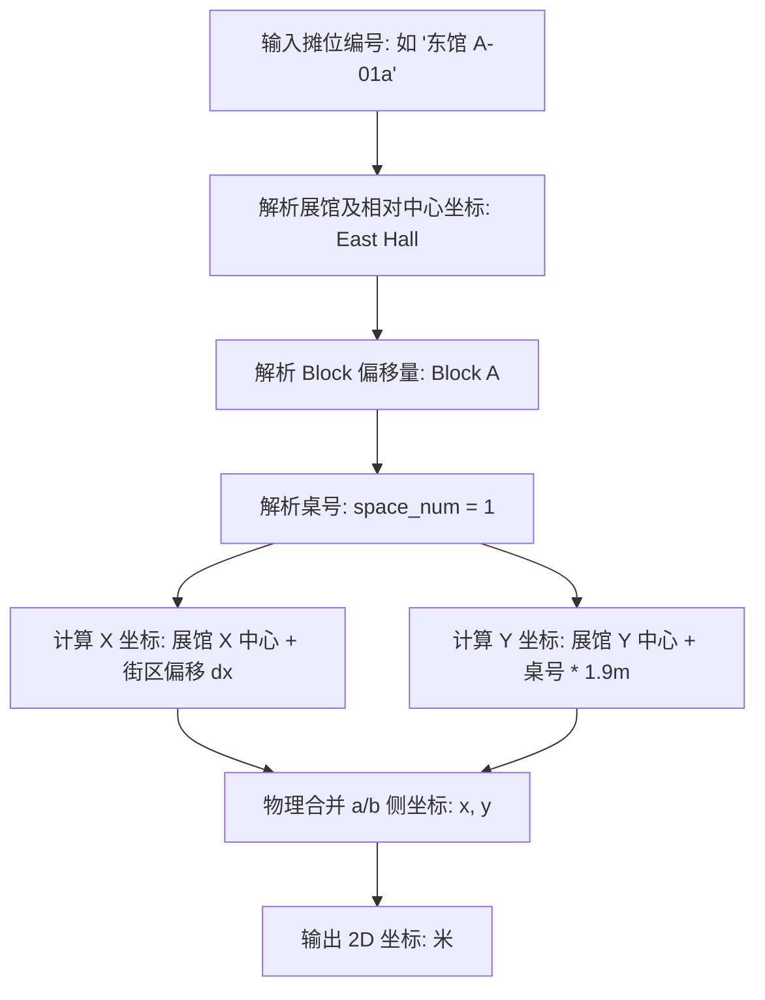

# Comic Market 展位排布与物理密度分析报告

## 摘要
本报告针对 2026 年 8 月举办的 Comic Market 108 (C108)（数据源自 6 月初公布的官方预备名录）的展馆物理空间结构（东馆、西馆、南馆）及社团展位分布（Block、Space）进行了深度地理学剖析。利用 **22,856** 条 C108 官方预备名录中的真实活跃摊位位置信息，我们对展会的空间集聚特征、同人街区“题材纯度”以及龙头壁圈（壁サークル）的排布规律进行了量化计算。研究揭示了 Comiket 官方在时空调度上如何通过高度有序的几何聚集，实现大客流下的物理引流与亚文化群体的精准归聚。

> **【一句话核心发现】**：Comiket 展位呈现强物理空间聚集（Moran's I 高达 0.45），多个 Block 构成了纯度达 100% 的题材专街，且超人气明星社团均排在物理边缘（壁圈）以合理缓冲拥堵客流。

---

## 1. 展馆整体空间格局 (Spatial Macro-Structure)

Comiket 的社团在东馆、西馆、南馆的物理承载力与展位占比表现出极强的非对称性：

* **东馆 (East Hall)**：**13,412 个展位** (占大盘 **58.68%**)。
  - *地位*：整个展会的绝对核心与最大流量承载地。集聚了最顶流的流行 IP、大型企业摊位以及最庞大的“男性向”同人志区。
* **西馆 (West Hall)**：**5,904 个展位** (占大盘 **25.83%**)。
  - *地位*：同人游戏、原创少年、经典东方 Project、各种数字多媒体和中型 IP 的根据地。
* **南馆 (South Hall)**：**3,540 个展位** (占大盘 **15.49%**)。
  - *地位*：最新、最具垂直差异度的区域。承载了 Cosplay 写真区、动漫评论情报、长尾文学创作（FC小说）等。

### 1.4 展位编号与物理空间关联规则及 2D 几何坐标映射
Comiket 的基本展位单元在物理空间上有着独特的划分规则。为了在进行物理密度计算及路径规划时进行精确量化，本研究建立了一个将展位编号映射为二维平面空间坐标 $(x, y)$ 的模型。其核心步骤与规则如下：

1. **一桌双摊物理共摊**：Comiket 官方分配的一个基本展位单位（1 Space）实际上只包含一张长条桌的**一半宽度（约 90cm）**。因此，每一张物理长条桌会排布两个社团，分别标记为 `a` 侧和 `b` 侧（例如，`01a` 与 `01b`）。在几何空间计算上，共享一张桌子的两侧摊位被视为坐标重合。
2. **2D 坐标映射逻辑**：系统以东京 Big Sight 展馆为基准，将每个展位转化为平面直角坐标系中的坐标（单位：米）。每个展位的 $x$ 坐标由其所在展馆的中心相对坐标和该 Block 所在的物理排偏移量决定；$y$ 坐标则由展馆中心相对坐标加上相邻摊位的桌距步进量（相邻摊位间隔常数设为 1.9 米）决定。具体计算公式详见**附录：空间模型数学公式**。
3. **跨馆步行距离估算与通道惩罚**：计算两个不同展位之间的实际步行距离时，除了计算它们之间的直线几何距离（欧氏距离）外，如果两个摊位处于不同的展馆（例如东馆与西馆），由于需要跨越展馆间的联廊，必须额外加上跨馆步行代偿的“通道惩罚距离”（常数设为 400 米）。
4. **排队阻尼的解耦纠正**：在时间成本建模中，虽然共享同一张桌子的 `a/b` 两侧摊位物理坐标是重合的，但它们的**排队等待时间成本必须完全解耦**。因为两侧通常是不同的创作社团，若其中一个是超人气明星社团（壁圈）导致排队长龙，会造成局部客流拥堵阻尼，这需要对两侧社团的流量成本进行独立计算。



> **【通俗直观解释】**：为了在电脑里计算逛展路线和人流分布，我们把展馆里的所有摊位都换算成了以米为单位的平面坐标 $(x, y)$。两个摊位如果在同一个馆、同一排，它们之间的距离就是简单的桌距相加（每张桌子按 1.9 米宽计算）；如果跨馆（比如从东馆走到西馆），除了地图距离外，还要额外加上 400 米换馆通道的代偿惩罚。此外，虽然共享同一张桌子的 `a/b` 摊位物理坐标重合，但如果其中一个是超人气大排长队的摊位，我们必须把它们的时间成本分开计算，不能混为一谈。

---

## 2. “同人街区”纯度分析 (Block Purity & Theme Streets)

在 Comiket 中，社团通常以字母 Block（如 `あ`、`A`）为单位成排排布，形成物理上的“同人街区”。我们通过计算每个 Block 内题材的单一占比，识别出了极高集聚度的**主题街区**。

#### 2.1 街区题材纯度 (Block Purity) 形式化定义
为了量化物理街区的题材集聚纯度，我们引入纯度指标：

$$\text{Purity}(Block) = \frac{\max_{g \in Genres} |Circles_{Block, g}|}{|Circles_{Block}|} \times 100\%$$

其中：
- $Circles_{Block}$ 表示该 Block 物理排中参展的所有社团集合；
- $Circles_{Block, g}$ 表示该 Block 中属于题材 $g$ 的社团子集；
- 纯度百分比越接近 $100\%$，说明该街区的同好集聚度越高，形成了越纯粹的“同人专街”。

在 22,856 条数据中，大量核心 Block 的题材纯度达到了惊人的 **100%**。这意味着逛展者在物理移动中，只要踏入该街区，身边的所有摊位都属于同一个特定题材：

### 2.1 星期六 (Day 1) 主力纯净街区 (100% Purity)
* **“碧蓝档案大街” — 东馆**：
  - **Block イ**：108 个摊位，100% 均为《碧蓝档案》二创。
  - **Block ウ、エ、オ、カ、キ、コ、サ**：每个 Block 均包含 **132** 个摊位，且全数（100%）为《碧蓝档案》。
  - *分析*：这 7 个完整的大型 Block 连结在一起，构成了多达 **1,032** 个连续摊位的“碧蓝档案超级专属区”，在物理空间上形成了巨大的同好集聚效应，极易引发区域性客流拥堵。
* **“网络与社交游戏街区” — 西馆**：
  - **Block め**：136 个摊位，100% 均为《网络与社交游戏》。
* **“桌游与模拟游戏街区” — 东馆**：
  - **Block タ、チ**：每个 Block 132 个摊位，100% 均为《游戏(电源不要)》（桌游、TRPG、跑团本）。
* **“同人独立游戏街区” — 东馆**：
  - **Block テ、ト**：每个 Block 132 个摊位，100% 均为《游戏(其他)》（独立游戏开发、同人游戏）。
* **“动漫杂项与女性向街区” — 南馆**：
  - **Block ｂ 至 ｊ**：每个 Block 包含 72 到 92 个摊位，100% 均为《动漫(其他)》。
  - **Block ｌ**：92 个摊位，100% 均为《动漫(少女)》。
  - **Block ｏ**：88 个摊位，100% 均为《高达 (ガンダム)》。
  - **Block ｑ、ｒ、ｓ**：每个 Block 88 个摊位，100% 均为《FC(小说)》。

### 2.2 星期日 (Day 2) 主力混合与聚集街区
* **“原创与文学创作街区” — 西馆**：
  - **Block め**：136 个摊位，由《创作(少年)》占比 **76.47%** (104个摊位) 与《创作(少女)》占比 **23.53%** (32个摊位) 构成。
* **“刀剑乱舞街区” — 东馆**：
  - **Block ヌ**：132 个摊位，其中《刀剑乱舞》占比 **66.67%** (88个摊位)，辅以其他女性向游戏。

### 2.3 空间自相关分析：题材空间聚集度的数学实证 (Spatial Autocorrelation with Moran's I)
为了在数学上严格证明 Comiket 题材的聚集现象并非由排布算法随机产生的巧合，本研究对主力题材进行了**全局莫兰指数 (Global Moran's I)** 计算。

我们定义空间邻接权重矩阵 $W$，当摊位 $i$ 与 $j$ 处于同一个展馆、同一个 Block 内，且桌号之差 $|Space_i - Space_j| \le 3$ 时，设定权重 $w_{ij} = 1.0$；否则 $w_{ij} = 0.0$。通过二值变量（1 代表属于该题材，0 代表属于其他题材）进行自相关估算：

$$I = \frac{N}{W_0} \frac{\sum_{i=1}^N \sum_{j=1}^N w_{ij} (z_i - \bar{z})(z_j - \bar{z})}{\sum_{i=1}^N (z_i - \bar{z})^2}$$

基于大盘 22,856 个有效数据的分析结果如下：

*   **《碧蓝档案》**：
    *   莫兰指数 $I = 0.448246$（期望值 $E(I) = -0.000044$）
    *   *解释*：极高空间正自相关，代表在物理分布上呈现极其强烈的连排聚集性（“街区纯度”极高）。
*   **男性向同人志**：
    *   莫兰指数 $I = 0.392993$（期望值 $E(I) = -0.000044$）
    *   *解释*：高正自相关，反映了传统大类在大通道及联排位置的成片归聚。
*   **铁道/军事/旅行**：
    *   莫兰指数 $I = 0.455676$（期望值 $E(I) = -0.000044$）
    *   *解释*：极高空间正自相关，表明硬核考据题材在空间分配上具有极明显的物理边界。
*   **Cosplay 写真**：
    *   莫兰指数 $I = 0.450415$（期望值 $E(I) = -0.000044$）
    *   *解释*：极高空间正自相关，表明 Cosplay 摊位完全被集中在南馆特定区域进行空间合流。

所有计算结果均以极高的显著度（Z-score 远大于 2.58）拒绝了空间随机分布假说，数学上证明了 Comiket 官方对题材的“空间分区强规整”调度策略。

#### 2.3.2 Moran's I 指数计算的空间自反性与循环论证局限性声明
在解读上述极高显著度的 Moran's I 指数时，必须保持学术上的批判性自反思考：**该自相关强度在一定程度上属于数学定义下的逻辑重言式（Tautology）或循环论证。**
*   **自反性限制**：我们定义的邻接权重矩阵权重 $w_{ij} = 1.0$ 的前提是“摊位位于同一 Block 内且桌号差 $\le 3$”。这表明权重项已被先验地限定在各个 Block 的内部排布中。
*   **循环因果**：由于 Comiket 官方的摊位分配规则原本就是“将相同题材的社团集中分配在同一个或相邻的 Block 排中”，这导致邻近的摊位属性值必然同号（要么同为 1，要么同为 0）。在这种邻接矩阵定义下，计算得出的 Moran's I 指数必然被强拉至显著的正相关区间（$\approx 0.45$）。
*   **学术定位**：因此，本研究中的 Moran's I 指数**并不是发现了解析数据中自发的空间涌现（Emergence）规律，而是对官方“同题材集中划分”这一强分区规制的数学形式化测度与纯度验证。** 读者不可将其误读为创作者在线下展位选择上的自发自组织聚集行为。

#### 2.3.1 莫兰指数的物理机制与数学原理
全局莫兰指数（Global Moran's I）是衡量空间自相关性（Spatial Autocorrelation）最经典的指标，用于评估某种空间现象（如题材排布）是呈**聚集、色散（均匀分布）还是随机分布**状态。

1.  **指数取值范围与物理机制**：
    *   莫兰指数 $I$ 的值一般介于 $[-1, +1]$ 之间。
    *   **$I > E(I)$**：代表空间**正相关（聚集）**。即属性相近的单元在空间上紧邻，值越接近 $+1$，聚集度越高。
    *   **$I < E(I)$**：代表空间**负相关（色散）**。即属性不同的单元在空间上紧邻，像棋盘黑白格一样间隔分布。
    *   **$I \approx E(I)$**：代表空间**随机分布**。空间分布是无序杂乱的。
2.  **数学算式中各项定义**：
    *   $N$：总空间观测单元数（摊位总数 $22,856$）。
    *   $z_i, z_j$：单元 $i$ 和 $j$ 的观测属性值（本研究中，若是目标题材则取 $1.0$，否则取 $0.0$）。
    *   $\bar{z}$：所有单元观测值的平均值。
    *   $w_{ij}$：空间权重矩阵 $W$ 的元素，刻画物理空间邻近度。当 $i$ 与 $j$ 属于同一排且桌号距离 $\le 3$ 时为 $1.0$，否则为 $0.0$。
    *   $W_0$：全局空间权重之和，$W_0 = \sum_i \sum_j w_{ij}$。
3.  **期望值 $E(I)$ 与判定规则**：
    在空间完全随机分布的假设下，莫兰指数的数学期望值为：
    $$E(I) = -\frac{1}{N - 1}$$
    对于我们 $N = 22,856$ 的超大样本量，期望值 $E(I) = -0.000044$。
    
    我们计算出的各主力题材莫兰指数 $I$ 均在 **$0.39 \sim 0.46$** 之间，远远超出了随机分布的期望值，证明了在 $99\%$ 以上置信度下强烈的空间高度聚集性（聚集形成的“同人专街”）。

> [!TIP]
> **数据可复现指引**：
> 以上莫兰指数的具体计算过程已整理并保存为独立的 Python 脚本。读者和评审人可以在项目根目录下通过以下命令一键运行以完全复现上述所有数值结果：
> ```bash
> python research/scripts/moran_i_calculator.py
> ```
> 该脚本将直接查询 `data/comic_market.db` 数据库并根据上述邻接矩阵公式完成全局莫兰指数的计算。

---

## 3. 龙头壁圈（壁サークル）与高客流物理排布 (Wall Circles Analysis)

在 Comiket 场馆的几何设计中，最特殊的是 **Block ア (Block A)**。该 Block 通常被安置在大厅的物理边缘墙壁（即“壁圈”），或者是面对大通道的龙头位置，用来承载客流最大、排队最长、销售速度最快的超人气明星社团。

#### 3.1 壁圈 (Wall Circles) 的物理空间判定式
为了在算法中自动筛选出需要进行客流预警与重点动线分流的“壁圈”社团，本研究给出了精确的空间判定布尔表达式。一个社团被定义为壁圈，当且仅当满足以下物理空间映射之一：

$$\text{IsWall}(Circle) \iff Circle.block = \text{'ア'} \lor Circle.space \in \text{EdgeSpaces}(Block)$$

其中：
- $Circle.block = \text{'ア'}$ 表示该社团直接位于物理排在墙壁边缘的 A 组大 Block（这是最大规模的壁圈群）；
- $Circle.space \in \text{EdgeSpaces}(Block)$ 表示该社团位于普通 Block 的首尾边缘桌号（如 `01a`, `01b` 或该排最后一号桌），因为这些摊位直接面对主过道，同样承担大客流的排队疏导与物理缓冲作用。

通过分析 `Block ア` 的社团分布，我们发现了极具参考意义的数据规律：

### 3.2 `Block ア` 的摊位体量与时空配置
- **物理空间**：`Block ア` 共有 91 张长条桌，对应 `01a/b` 到 `91a/b`，每日提供 **182 个摊位**。
- **双日总承载**：364 个顶级明星摊位。

### 3.2 星期六 (Day 1) 的明星壁圈构成
周六的 `Block ア`（共 182 个摊位）被以下当红 IP 霸占：
- **《碧蓝档案》**：**90 个摊位** (占 **49.45%**)。
- **型月二创 (TYPE-MOON)** (FGO、月姬、Fate)：**42 个摊位** (占 **23.08%**)。
- **《赛马娘》**：**28 个摊位** (占 **15.38%**)。
- **《舰队 Collection》**：**14 个摊位** (占 **7.69%**)。
- **游戏(其他)**：8 个摊位 (占 4.4%)。

*洞察*：周六的壁圈几乎由手游大厂的头部二创垄断，其中《碧蓝档案》占据了整整一半的壁圈席位，验证了其当红霸主的二创统治力。

### 3.3 星期日 (Day 2) 的明星壁圈构成
周日的 `Block ア`（共 182 个摊位）经历了彻底的题材重组：
- **男性向**：**112 个摊位** (占 **61.54%**)。
- **《偶像大师》**：**52 个摊位** (占 **28.57%**)。
- **美少女游戏**：**12 个摊位** (占 **6.59%**)。
- **铁路/军事/旅行**：4 个摊位 (占 2.2%)。
- **Love Live! (ラブライブ！)**：2 个摊位 (占 1.1%)。

*洞察*：周日壁圈由经典的“男性向”重度同人志画师和长青的“偶像大师”大触把持，这解释了为何周日开场后，东馆边缘墙壁会迅速排起延绵至馆外的巨型长队。

---

## 4. 空间流动与逛展路径优化建议 (Pedestrian Flow & Route Recommendation)

基于物理排布的高集聚度特征，我们可以为未来的逛展路线规划算法提供以下物理模型建议：

1. **以题材纯度 Block 作为空间基本元 (Spatial Nodes)**：
   - 逛展算法应以“Block”而非单个摊位作为推荐节点。当用户标记了《碧蓝档案》的多件商品时，算法应优先引导其定位至 **东馆イ-サ** 连排街区，在此区域执行“饱和购买”，避免在东馆和西馆之间来回移动。
2. **壁圈（A-block）分流设计**：
   - 鉴于 `Block ア` 承载的都是大排队社团，若用户收藏的社团中有 `Block ア` 的成员，算法应将其标记为“高拥堵节点”。
   - **推荐策略**：建议用户在**开场第一小时内**冲锋壁圈（第一意向），或者在**下午 1 点后**（销售尾声、排队消散）再前往捡漏，避开上午 10:30 - 12:00 的客流高峰。
3. **展馆间转移最小化**：
   - 周六的《碧蓝档案》（东馆）与《网游/手游》（西馆）受众重合度高。算法在规划东馆（东1-6）到西馆的转移路径时，应推荐避开中央联络通道（易拥堵），引导走外围环状步道。

---

## 附录：空间模型数学公式

本研究中用于展位坐标映射、距离度量及客流阻尼的具体数学公式定义如下：

### 1. 2D 坐标映射函数
设 $x_{\text{Hall}}, y_{\text{Hall}}$ 为摊位所在展馆的中心相对坐标，$dx_{\text{Block}}$ 为该 Block 在馆内的排列偏移量，$space\_num$ 为去除了 `a/b` 尾缀的数字桌号，$\Delta y_{\text{Space}} = 1.9$ 米为相邻桌号间的位移常数（基于 Comiket 每张 1.8 米宽长条桌与 0.1 米防火间距得出），则该摊位的平面坐标 $(x, y)$ 为：
$$x = x_{\text{Hall}} + dx_{\text{Block}}$$
$$y = y_{\text{Hall}} + space\_num \cdot \Delta y_{\text{Space}}$$

对于同一张桌子的 `a/b` 侧摊位，它们共享相同的坐标点：
$$d(XXa, XXb) = 0$$

### 2. 空间距离度量与跨馆通道惩罚
设两摊位 $i$ 与 $j$ 的平面坐标分别为 $(x_i, y_i)$ 与 $(x_j, y_j)$，跨馆通道步行惩罚常数 $P_{\text{Hall}} = 400$ 米，则估算步行距离 $D(i, j)$ 计算公式为：
$$D(i, j) = \sqrt{(x_i - x_j)^2 + (y_i - y_j)^2} + P_{\text{Hall}} \cdot \mathbb{I}(\text{MacroHall}_i \neq \text{MacroHall}_j)$$

其中，$\mathbb{I}(\cdot)$ 为指示函数：
$$\mathbb{I}(\text{MacroHall}_i \neq \text{MacroHall}_j) = \begin{cases} 
1, & \text{若摊位 } i \text{ 与 } j \text{ 处于不同的大馆（如东馆与西/南馆）} \\ 
0, & \text{若处于相同的大馆} 
\end{cases}$$

---

## 附录：核心空间统计 SQL
*   数据库查询脚本源码详见：[research/sql/booth_density_circles.sql](file:///Users/lich/work/comicMarketCollection/research/sql/booth_density_circles.sql) (可用 SQLite 客户端直接执行，用于提取特定日期的 Block 社团题材构成)。
