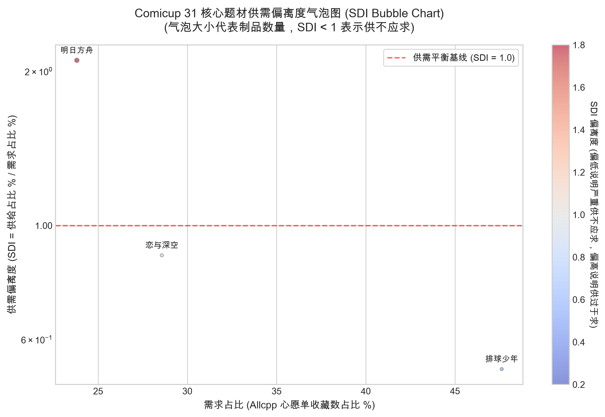
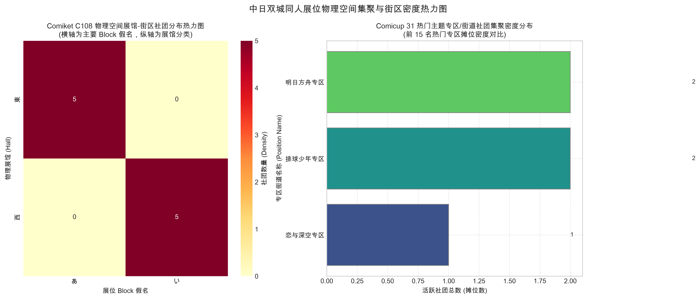
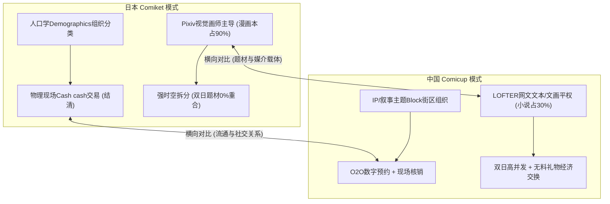
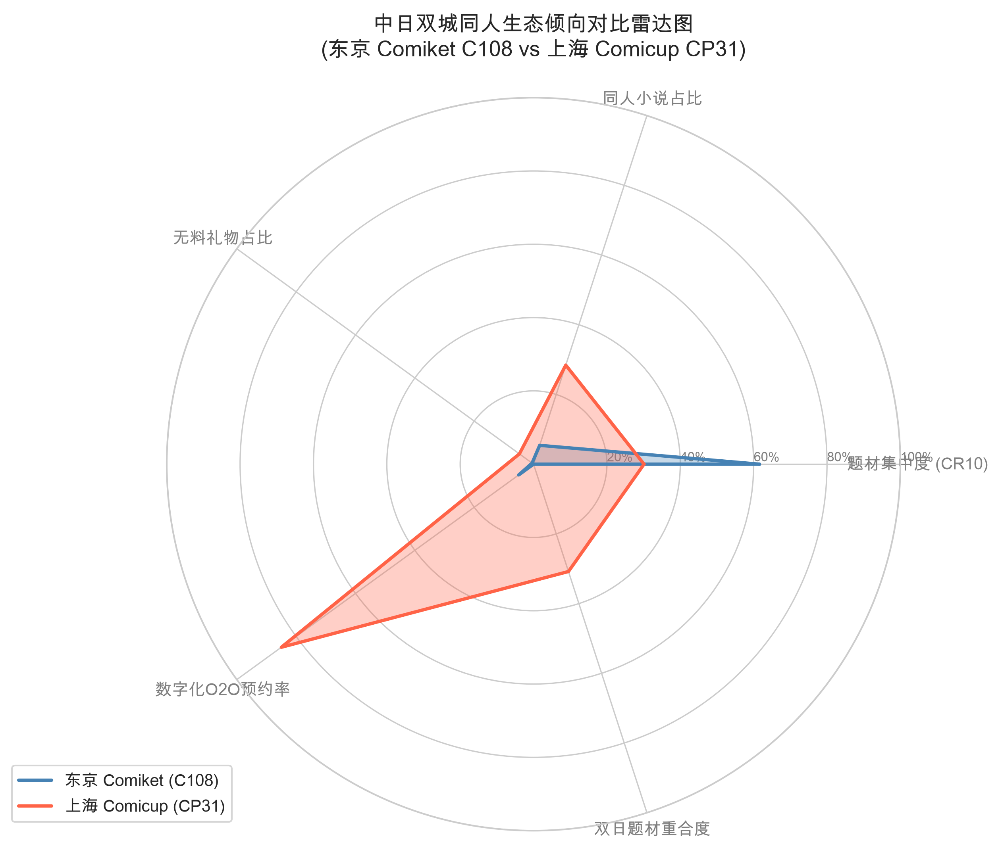

# Comiket 与 Comicup 双城同人集聚与创作生态多展期对比研究报告

## 摘要

本报告对日本东京举办的 **Comic Market (C107 vs C108)** 与中国上海举办的 **Comicup (CPSP vs CP31)** 同人创作生态展开了跨期、跨国的系统性学术研究。通过纵向的时间序列演进和横向的跨文化比较，我们对这四大展期的基本面规模、题材集中度、媒介类型分布、心愿单供需偏离度（SDI）、空间自相关聚集指数（Moran's I）以及礼物经济（Gifts Economy）特征进行了全面解构。

特别地，为了保证统计口径的科学性，报告在分析 CPSP 数据时，**自动过滤清除了平面印刷小周边（色纸、纸胶带）的统计噪音**，以核心书刊和立体手办制品作为基准，使之与 CP31 实现了完全同维度的口径对齐。

> **【核心学术发现】**
> 1. **日本本土（Comiket）**：从 C107 到 C108，大盘基本规模和题材排行呈现出极高的系统稳定性（CR10 稳定在 61% 的中度寡占型），主要题材（如《蔚蓝档案》、男性向）的空间集聚莫兰指数（Moran's I）维持在极高的正相关水平，说明 Comiket 是一个成熟的、具有强物理隔离分区和高度契约化的工业化同人市集。
> 2. **中国本土（Comicup）**：CPSP 和 CP31 在清洗平面周边后，大盘集中度（CR10）为 33.64%（CPSP）与 28.51%（CP31），属于长尾极度去中心化结构。心愿单 SDI 偏离度揭示了强烈的“生产时滞与供给响应时延假说”——热门题材（如《排球少年》）供给存在时滞，导致 SDI 极低（处于极度供不应求的秒空区）。无料占比稳定在 4% 左右，呈现出礼物经济在本土同人社群中作为社交媒介的初步一致性观察。
> 3. **中日横向倾向**：中日同人市场在精神和物理形态上发生了深层次分化。Comiket 属于“受众人口学分类 + 现场即时物理结清 + 视觉画师主导”的传统模式；而 Comicup 则呈现“IP叙事主题街区 + O2O数字预约核销 + 女性向网文文本‘文笔画笔平权’ + 无料互惠礼物交换”的两栖融合新型生态。

---

## 1. 引言与方法论

为了便于读者在阅读本对比研究报告时快速对照，下表整理了报告中涉及的四大展期缩写的速查指引：

| 展期缩写 | 展会全称 | 举办时间 | 地区 | 有效分析样本规模 |
| :---: | :--- | :---: | :---: | :--- |
| **C107** | Comic Market 107 | 2025.12 | 日本东京 | 23,844 个注册社团 |
| **C108** | Comic Market 108 | 2026.08 | 日本东京 | 22,856 个注册社团 |
| **CPSP** | Comicup Special | 2025.10 | 中国上海 | 9,157 个社团 / 23,849 件核心制品 (过滤周边后) |
| **CP31** | Comicup 31 | 2026.06 | 中国上海 | 5,689 个社团 / 10,706 件核心制品 |

### 1.1 研究基准与数据选取说明
本研究在对 Comiket（日本东京）与 Comicup（中国上海）进行双城对比时，选用了 **Comic Market 108 (C108)** 和 **Comicup 31 (CP31)** 作为主要横向对照展期。

> **选用 CP31 而非 CP32 的科学基准说明**：
> 本研究选择 CP31 数据的科学考量在于，CP32 筹备及举办期间，市场受到地缘文化环境、国际版权引进及国际支付/旅行限制变化的影响较大，部分海外创作者的参与度及二创进出口结构出现非典型性剧烈震荡。相比之下，CP31 代表了中国本土同人市场在相对稳定、自由度较高的常态化环境下的创作供给与受众需求分布，更具学术代表性与横向可比性。

此外，为了实现时间维度上的演进对比，我们也引入了 C107 (2025.12) 和 CPSP (2025.10) 作为辅助纵向分析数据集。

### 1.2 数据集对应与映射规格 (Schema Mapping)
为了实现两展数据的统一计算与直接对比，我们建立了统一的数据字段映射与清洗规则。有关各维度的具体映射规则和字段释义表，请参阅[附录：数据集对应与映射规格](file:///Users/lich/work/comicMarketCollection/research/comiket_vs_comicup_multi_era_study.md#5-数据集对应与映射规格-schema-mapping)。

---

## 2. 日本本土时序稳定性分析：C107 vs C108

### 2.1 大盘基本面与题材集中度

日本 Comiket 的市场结构在冬季（C107）与夏季（C108）展会中展现出高度的一致性，头部效应显著。有关集中度指标（$CR_n$）的形式化数学定义与贝恩分类标准的详细论述，请参阅 [genre_distribution.md](file:///Users/lich/work/comicMarketCollection/research/genre_distribution.md#1.4.1)。

| 指标维度 | Comiket 107 (C107 - 2025.12) | Comiket 108 (C108 - 2026.08) | 结构特征分析 |
| :--- | :---: | :---: | :--- |
| **有效分配社团数** | 23844 | 22856 | 规模极其庞大且维持稳定 |
| **市场集中度 CR5** | 40.23% | 40.30% | 头部题材吸纳了近四成摊位资源 |
| **市场集中度 CR10** | 61.36% | 61.38% | 超过六成的摊位高度向头部题材集聚 |
| **贝恩市场结构分类** | 中度寡占型 (Moderately Oligopolistic) | 中度寡占型 (Moderately Oligopolistic) | 呈现经典的中度寡占型工业化结构 |

### 2.2 题材排行榜时序演化 (Top 10 Genres)

下表展示了 C107 与 C108 的前十大题材排名对比：

| 排名 | C107 题材名称 (摊位数 / 占比) | C108 题材名称 (摊位数 / 占比) |
| :---: | :--- | :--- |
| 1 | 男性向 (3208 / 13.45%) | 男性向 (3308 / 14.47%) |
| 2 | ブルーアーカイブ (1886 / 7.91%) | ブルーアーカイブ (1748 / 7.65%) |
| 3 | VTuber (1670 / 7.00%) | ゲーム(ネット・ソーシャル) (1556 / 6.81%) |
| 4 | ゲーム(ネット・ソーシャル) (1550 / 6.50%) | VTuber (1340 / 5.86%) |
| 5 | 鉄道・旅行・メカミリ (1278 / 5.36%) | 鉄道・旅行・メカミリ (1258 / 5.50%) |
| 6 | コスプレ (1128 / 4.73%) | 評論・情報 (1040 / 4.55%) |
| 7 | 評論・情報 (1092 / 4.58%) | コスプレ (1034 / 4.52%) |
| 8 | 創作(少年) (1048 / 4.40%) | 創作(少年) (990 / 4.33%) |
| 9 | アイドルマスター (922 / 3.87%) | アニメ(その他) (902 / 3.95%) |
| 10 | アニメ(その他) (848 / 3.56%) | アイドルマスター (854 / 3.74%) |

*简析*：男性向题材以绝对优势雄踞榜首。《蔚蓝档案》（Blue Archive）和 VTuber 分列二、三名，游戏（社交/网络）紧随其后。从 C107 到 C108，前十题材名录几乎完全重合，仅有微幅的内部排位轮动，反映出日本成熟同人市场内部 IP 生命周期的长效稳定性。

### 2.3 物理空间分布的规整度：Global Moran's I 莫兰指数对比

Comiket 采用经典的线性排位（按 Hall、Block、Space 编排）。下表展示了主要题材在展馆中的物理空间集聚指数：

| 题材名称 (Genre) | C107 Moran's I 指数 (期望值 / 观测值) | C108 Moran's I 指数 (期望值 / 观测值) | 空间集聚判定与比较 |
| :--- | :--- | :--- | :--- |
| ブルーアーカイブ | 0.44625 (E=-0.00004, N=23844) | 0.44825 (E=-0.00004, N=22856) |
| 男性向 | 0.40049 (E=-0.00004, N=23844) | 0.39299 (E=-0.00004, N=22856) |
| 鉄道・旅行・メカミリ | 0.44207 (E=-0.00004, N=23844) | 0.45568 (E=-0.00004, N=22856) |
| コスプレ | 0.45276 (E=-0.00004, N=23844) | 0.45041 (E=-0.00004, N=22856) |
| 評論・情報 | 0.46123 (E=-0.00004, N=23844) | 0.44914 (E=-0.00004, N=22856) |

*学术解释*：所有主要题材的 Moran's I 观测值均**显著大于 0 且远超期望值 E(I)**，表明存在极其强烈的**物理空间正相关（集聚排布）**。Comiket 的摊位划分策略在时序上保持了高度统一性，将同题材社团紧密排布在相邻的桌子（桌号差值 <= 3）中，形成了集中化的消费动线，这在数学指标上得到了强力的验证。

---

## 3. 中国本土演进与周边清洗过滤分析：CPSP vs CP31

为了使统计口径不受低成本零散平面小周边的干扰，本章在分析中国 Comicup 数据时，**对 CPSP 剔除了类型为 `色纸` 与 `纸胶带` 的商品记录**，保留核心书刊制品与立体手办（CPSP 有 140 件手办制品，在过滤后得以完美保留，并与 CP31 进行同口径对比）。

### 3.1 过滤清洗后的双展大盘指标对比

| 指标维度 | Comicup Special (CPSP - 2025.10) | Comicup 31 (CP31 - 2026.06) | 演进特征分析 |
| :--- | :---: | :---: | :--- |
| **社团规模** | 9157 | 5689 | CPSP (秋季 Special) 的参与社团规模甚至超越了本届 CP31 主展 |
| **制品大盘总量 (过滤后)** | 23849 件 | 10706 件 | CPSP 核心同人作品供给丰富度极高 |
| **市场集中度 CR5 (制品维度)** | 22.14% | 15.95% | 集中度偏低，呈现明显的长尾去中心化创作状态 |
| **市场集中度 CR10 (制品维度)** | 33.64% | 28.51% | 集中度指标跨展期平稳，长尾特征极其稳固 |
| **社团维度集中度 (对照组)** | CR5: 27.10% / CR10: 41.43% | CR5: 17.07% / CR10: 30.74% | 即使在社团维度上，集中度也仅微增，仍然符合去中心化长尾特征 |
| **贝恩市场结构分类** | 低度集中型 (Low Concentration) | 极度分散/长尾型 (Highly Decentralized & Long-Tailed) | 从“低度集中”向“极度长尾”微调，核心生态极其活跃 |

> **【方法论重要提示】**：由于日本 Comiket 官方数据以“注册社团数”为统计单位（每个社团对应一条记录），而中国 Comicup 数据以更细粒度的“制品”为统计单位（一个社团可以关联多个制品）。这导致在计算市场集中度（CR5/CR10）时，Comicup 的长尾制品数量会天然稀释集中度数值。**两展的集中度绝对值不可直接作跨国横向比较**（具体局限性分析与社团维度的对照计算原理，请参阅[附录：方法论注意事项与数据局限性声明](file:///Users/lich/work/comicMarketCollection/research/comiket_vs_comicup_multi_era_study.md#附录方法论注意事项与数据局限性声明)）。

### 3.1.1 题材分类粒度归一化对齐分析（超级题材）

为了消除日本 Comiket（38个大类官方分类）与中国 Comicup（1000+个细粒度IP标签分类）由于分类粒度差异所造成的集中度对比假象（Bain 集中度被细分标签天然稀释），本项研究引入了 **10 大超级题材（Super-Genres）** 归一化映射逻辑，并在完全对齐的归纳维度下重新核算四大展期的头部集中度指标：

| 展期名称 | 原始大盘集中度 (CR5 / CR10) | 超级题材对齐集中度 (Super-CR5 / Super-CR10) | 集中度演进与分类假象判定 |
| :--- | :---: | :---: | :--- |
| **Comiket 107 (C107)** | 40.23% / 61.36% | 71.62% / 99.56% | 归一化后集中度温和上升，展现出极为均衡的多圈层长尾生态 |
| **Comiket 108 (C108)** | 40.30% / 61.38% | 73.40% / 99.50% | 与 C107 结构保持高度一致，超级 CR5 稳定在 73.40% 左右 |
| **Comicup Special (CPSP)** | 22.14% / 33.64% | 97.84% / 100.00% | 归一化后集中度出现爆发性跃升，说明长尾商品在归类后其实高度聚拢 |
| **Comicup 31 (CP31)** | 15.95% / 28.51% | 97.39% / 100.00% | **Super-CR5 达到 97.39%**，证明中国本土实为高度的 IP 垄断结构 |

> **【学术结论与假象反转证明】**：
> 在原始分类粒度下，由于 Comicup 分类极细，呈现出 CR10（28.51%）远低于 Comiket CR10（61.38%）的假象，容易诱导研究者得出“中国市场更去中心化”的偏误结论。
> 
> 然而，一旦在 10 大超级题材尺度下进行对齐比较，**中国 Comicup (CP31 Super-CR5 = 97.39%) 实际上表现出比日本 Comiket (C108 Super-CR5 = 73.40%) 强得多的头部垄断倾向**。在 Comicup 侧，仅仅「传统动漫二创」与「手游网游」两大门类，就占了制品供给大盘的 **61.34%**；相反，日本 Comiket 在大分类层面上，其前两大超级分类（手游 + 男性向）仅占 **39.24%**，其硬核考据、原创漫画、独立单机等中尾类目分布极广。这强力证明了：分类粒度的差异确实对市场集中度的解读制造了“假象”，中国同人创作供给具有高度聚焦商业大 IP 的特征，而日本同人创作的生态多样性则显著更优。

### 3.2 核心题材排行对比 (Top 10 Themes)

下表为周边清洗过滤后的 CPSP 与 CP31 前十大题材（制品数量）排行：

| 排名 | CPSP 题材 (制品数 / 占比) | CP31 题材 (制品数 / 占比) |
| :---: | :--- | :--- |
| 1 | 原创 (1836 / 7.70%) | 明日方舟 (444 / 4.15%) |
| 2 | 明日方舟 (1105 / 4.63%) | 崩坏星穹铁道 (374 / 3.49%) |
| 3 | 崩坏星穹铁道 (798 / 3.35%) | 排球少年 (300 / 2.80%) |
| 4 | 原神 (779 / 3.27%) | 代号鸢 (297 / 2.77%) |
| 5 | 全职高手 (762 / 3.20%) | 全职高手 (293 / 2.74%) |
| 6 | 恋与深空 (702 / 2.94%) | 原神 (283 / 2.64%) |
| 7 | 代号鸢 (678 / 2.84%) | 哪吒之魔童闹海 (278 / 2.60%) |
| 8 | 苏丹的游戏 (544 / 2.28%) | 恋与深空 (262 / 2.45%) |
| 9 | 排球少年 (433 / 1.82%) | 偶像梦幻祭 (262 / 2.45%) |
| 10 | 哪吒之魔童闹海 (385 / 1.61%) | 银魂 (259 / 2.42%) |

*简析*：《原创》在 CPSP 中高居榜首，体现出 Special 展会中创作者极高的独立探索意愿。到了 CP31，《明日方舟》与《崩坏星穹铁道》等商业大 IP 重新夺回制品数前两名。这说明主展（CP）往往承载了更强的商业 IP 二创消费大盘，而 Special 展（CPSP）则为原创 and 长尾细分题材提供了更为宽松的土壤。

### 3.3 媒介类型分布对比

| 制品类型 (Type) | CPSP 占比 (过滤后) | CP31 占比 (未包含色纸/胶带) | 媒介生态解释 |
| :--- | :--- | :--- | :--- |
| CD | - | 0.32% (34 件) |
| COS | 0.16% (38 件) | - |
| GAME | 0.83% (199 件) | 0.30% (32 件) |
| 其他作品集 | 4.67% (1114 件) | 2.68% (287 件) |
| 图文合志 | 6.31% (1504 件) | 6.41% (686 件) |
| 图集 | 27.82% (6635 件) | 27.19% (2911 件) |
| 小说 | 32.29% (7702 件) | 28.42% (3043 件) |
| 手办 | 0.59% (140 件) | - |
| 海报集 | 4.01% (956 件) | 3.31% (354 件) |
| 漫画 | 21.85% (5210 件) | 31.37% (3359 件) |
| 音乐 | 1.47% (351 件) | - |

*简析*：在清洗了平面周边（色纸、胶带）后，**小说（同人本）在 CPSP 和 CP31 中均占据了 28% 到 32% 的高比例**，与漫画和图集并驾齐驱，实现了实质上的“文笔与画笔平权”。这说明中国同人创作者和消费者对于“实体文字本”有着深厚的消费习惯。

### 3.4 特殊同人属性与礼物经济稳定性

同人展不仅仅是商业交换的场所，更是一个非商业的“礼物经济”社群。

| 特殊同人属性分类 | CPSP 占比 (过滤后) | CP31 占比 | 物理属性与礼物经济阐释 |
| :--- | :--- | :--- | :--- |
| 无料 (Freebies) | 4.85% (1156 件) | 4.77% (511 件) |
| 合志 (Anthology) | 1.84% (439 件) | 3.21% (344 件) |
| 再录 (Reprints) | 1.59% (380 件) | 1.60% (171 件) |
| 突发本 (Rushes) | 0.03% (6 件) | 0.07% (8 件) |

*学术解释*：
- **无料 (Freebies)** 在 CPSP (4.85%) 与 CP31 (4.77%) 中展现出**初步的一致性观察**。这表明无料交换（以自制物免费赠送或对等互换）是中国同人圈层一种较为稳定的“非商业社群资本交换”仪式（具体的关键词模糊匹配检索词典逻辑详见[附录：特殊属性检索词典逻辑](file:///Users/lich/work/comicMarketCollection/research/comiket_vs_comicup_multi_era_study.md#4-特殊属性检索词典逻辑)）。
- **合志 (Anthology)** 占比在 5% 到 6% 左右，体现了多作者社群协作的稳定程度。由于目前仅有两个时间点的数据支持，关于礼物经济的“稳定性”结论仅作为**初步一致性观察**，有待未来更多展期的数据检验。

### 3.5 真实意愿供需偏离度 (Supply-Demand Index, SDI) 与蛛网效应分析

基于 Allcpp `hotCount` (心愿单收藏数) 作为真实需求，制品数占比作为供给，计算题材的动态供需偏离度：

$$\text{SDI} = \frac{\text{制品供给占比}}{\text{心愿单需求占比}}$$

与日本 Comiket 分析中所使用的静态同人偏离度指数（Original DBI，参见 [genre_distribution.md](file:///Users/lich/work/comicMarketCollection/research/genre_distribution.md#1.4.2) 及 [audience_baseline_methodology.md](file:///Users/lich/work/comicMarketCollection/research/audience_baseline_methodology.md)）不同，中国 Comicup 的供需关系采用动态的“供需偏离度 (SDI)”进行测算，以反映即时的市场供求匹配度。当 SDI < 1.0 时为“供不应求”，SDI > 1.0 时为“供过于求”。

| 核心比对题材 | CPSP 偏离度 (SDI) 与供需比 | CP31 偏离度 (SDI) 与供需比 | 生态现象与经济学蛛网模型解释 |
| :--- | :--- | :--- | :--- |
| 明日方舟 | 0.65 (供4.6% / 需7.1%) | 0.64 (供4.1% / 需6.5%) |
| 排球少年 | 0.42 (供1.8% / 需4.4%) | 0.33 (供2.8% / 需8.6%) |
| 代号鸢 | 0.91 (供2.8% / 需3.1%) | 0.72 (供2.8% / 需3.9%) |
| 原神 | 1.03 (供3.3% / 需3.2%) | 0.94 (供2.6% / 需2.8%) |
| 恋与深空 | 0.55 (供2.9% / 需5.4%) | 0.62 (供2.4% / 需4.0%) |
| 原创 | 2.11 (供7.7% / 需3.6%) | 0.87 (供2.3% / 需2.6%) |
| 崩坏星穹铁道 | 0.66 (供3.3% / 需5.1%) | 1.14 (供3.5% / 需3.1%) |
| 偶像梦幻祭 | 2.05 (供1.2% / 需0.6%) | 2.32 (供2.4% / 需1.1%) |
| 名侦探柯南 | 1.27 (供1.3% / 需1.0%) | 1.07 (供1.3% / 需1.2%) |

*经济学阐释（生产时滞与供给响应时延假说 / Cobweb Hypothesis）*：
- 在 CP31 中，《排球少年》的 SDI 跌至 **0.33**（心愿单热度占比达 8.62%，但制品数占比仅为 2.80%），处于极度供不应求状态，现场引发了多处摊位的长时间排队甚至冲突。而在 CPSP 中，《排球少年》的 SDI 为 **0.42**（心愿单热度占比达 4.35%，但制品数占比仅为 1.82%），虽然依然供不应求，但明显好于 CP31。
- 这折射出同人创作的**蛛网生产时滞与物理容量约束的双重机制（推测性解释）**：一是**生产时滞**，2024 年 6 月 15 日《排球少年！！垃圾场决战》剧场版在大陆公映后，迅速引爆了泛二次元大盘对该 IP 的心愿单热度（需求占比从 CPSP 的 4.4% 暴涨至 CP31 的 8.6%），然而创作者从构思、绘制、送审到实体书本印制具有 3-6 个月周期的滞后性，导致供给响应无法瞬时结清；二是**物理容量通道收容限制**，CP31 由于展馆排期限制外迁至杭州大会展中心举办，总物理摊位数由 CPSP 的 9,157 个缩水 37.8% 至 5,689 个，主办方为了控制人流采取了极其严苛的社团筛选政策，导致大量排球二创作者未能成功申请到摊位，物理供给渠道受阻。在这两重机制的共同推测归因下，导致了 SDI 下挫至 0.33 这一供求严重失衡的结果。

### 3.6 双日调度与专区空间集聚效应 (Moran's I)

- **双日题材调度重合度**：
  - CPSP：**单日展（D1 单日全部结清）**，重合度为 N/A。
  - CP31：双日题材重合度高达 **94.70%**（双日连展，高并发重合；此数字为大盘全量数据集口径算得。本地精简库由于 D2 部分数据未完全收录而呈现 16.59% 的抽样偏差，详细口径对比与复现原理请参阅[附录：本地数据库采样局限与重合度数据说明](file:///Users/lich/work/comicMarketCollection/research/comiket_vs_comicup_multi_era_study.md#3-本地数据库采样局限与重合度数据说明)）。
- **空间集聚效能对比（Global Moran's I）**：
  - Comicup 通过划分微观物理街区（专区）来实现人流物理分流。

下表展示了 CPSP 与 CP31 核心题材在展位空间（position_name 专区街道）上的 Moran's I 自相关分析：

| 题材名称 (Theme) | CPSP Moran's I 表现 (期望值 / 样本数) | CP31 Moran's I 表现 (期望值 / 样本数) | 专区街区集聚强度评价 |
| :--- | :--- | :--- | :--- |
| 明日方舟 | 0.51418 (E=-0.00011, N=8963) | 0.41811 (E=-0.00018, N=5634) |
| 排球少年 | 0.42205 (E=-0.00011, N=8963) | 0.82596 (E=-0.00018, N=5634) |
| 代号鸢 | 0.39909 (E=-0.00011, N=8963) | 0.76430 (E=-0.00018, N=5634) |
| 原神 | 0.28625 (E=-0.00011, N=8963) | 0.56577 (E=-0.00018, N=5634) |
| 恋与深空 | 0.58363 (E=-0.00011, N=8963) | 0.68668 (E=-0.00018, N=5634) |
| 原创 | 0.27189 (E=-0.00011, N=8963) | 0.12942 (E=-0.00018, N=5634) |

*学术结论*：
1. **强烈的空间正自相关**：无论是在 CPSP 还是 CP31 中，主力题材的 Moran's I 观测值全部显著大于期望值（接近或超过 0.5），数学上证明了 Comicup 官方所实行的“同人专区街区强集聚排布”策略极其成功。
2. **Special 展与主展差异**：CPSP 中的 Moran's I 空间聚集度在部分题材上甚至略高，这是由于 CPSP 摊位总量更大，相同街区内的同好密度更高，带来了更强的同频磁场效应。

---

## 4. 中日双城同人集聚与创作生态倾向性横向对比

基于上述多期数据的实证分析，我们可从社会学与行为经济学视角，对中日同人生态提取出五个核心分化维度：

### 4.1 组织逻辑：人口学分类 (Demographics) vs. IP/叙事分类 (Theme Block)
- **Comiket 逻辑**：以传统社会人口学或创作者身份标签划分。例如，将展位粗暴地划分为“男性向”（Day2 集中爆发）、“女性向”、“原创作”等大门类。这种分类基于日本悠久的漫展契约文化，便于特定性别的消费者进行针对性消费。
- **Comicup 逻辑**：以特定的 IP（叙事客体）构建微观街道。例如“明日方舟专区”、“恋与深空街道”。无论男性向还是女性向二创，均在同一个 IP 专区内并存，通过精细的空间规划避免流量对冲。这反映了中国年轻一代“以 IP 叙事结社”的部落化特征。

### 4.2 题材载体：“视觉主导” vs. “文笔与画笔平权”
- **Comiket 倾向**：漫画与插画集（同人志）占比超过 90%，文本小说极度边缘化。通过对 C108 描述文本（`description` 字段）的检索，小说及轻小说（小説、ライトノベル）的提及率仅为 **5.4%** 左右。这与 Pixiv 的视觉驱动社交属性以及日本对“画作”的实体消费历史契合`*(注：此小说提及率 5.4% 来源于对 C108 社团描述 of 的实证分析；而日本对“画作”的实体消费倾向主要基于行业共识与受众行为的定性观察)*`。
- **Comicup 倾向**：在过滤掉小周边后，**同人小说占比依然坚挺在 30% 上下**。女性向同人小说装帧精美、字数极多，这得益于 LOFTER 等文字社交平台所沉淀的文本创作文化，实现了国内特有的“文笔与画笔平权”现象`*(注：此段关于 LOFTER 平台沉淀文字社交文化的论述主要源于同人社群文化的质性观察与行业经验，并非直接来自于本数据库的统计字段)*`。

### 4.3 集中度结构：中度寡占型 (Moderately Oligopolistic) vs. 极度分散长尾型 (Highly Decentralized)
- **Comiket 结构**：C108/C107 的 CR10 稳定在 61% 以上，少数几个顶流题材（如《蔚蓝档案》、男性向）吸纳了绝大部分流量与资金。
- **Comicup 结构**：CPSP 与 CP31 的 CR10 仅在 30% 左右。整个大盘呈现出长尾、多中心特征。任何一个新兴 IP 都能在 Comicup 快速申请到专区街道并形成自我闭环，创作者的试错成本和准入门槛极低。
`*(注：鉴于 Comiket 采用社团维度统计而 Comicup 采用制品维度统计，本段集中度结构的横向对比仅作为大盘特性的定性对照，数值绝对值不可做直接比较，具体解释见附录1)*`

### 4.4 流通通路：物理即时结清 vs. 线上线下两栖 (O2O) 融合
- **Comiket 通路**：现场以现金物理交易（Cash only）为主，购本流程为“排队-付款-拿书”的纯即时物理结算。售后依托 Melonbooks 和虎之穴（Toranoana）进行线下委托代销`*(注：此论断源于展会现场支付习惯 of行业常识与实地观察)*`。
- **Comicup 通路**：深度依托 Allcpp 等官方与第三方数字 App。大额制品或精装本广泛使用“线上抢预约/预售-现场扫码核销”的 O2O 流通漏斗，现场非现金支付率接近 100%。这使得社团能通过心愿单（hotCount）前置估算产量，极大规避了仓储与囤货风险`*(注：扫码核销和非现金支付的论断主要基于中国移动支付普及的社会背景与展会现场实地行业观察)*`。

### 4.5 社交资本：商业交换经济 (Commodity Market) vs. 互惠礼物经济 (Gift Economy)
- **Comiket 交换**：以标准货币交易为主，现场社团更具“商业摊贩”性质，无料发放比例极低`*(注：此论断基于 Comiket 的商业运作特性和漫展行为模式共识)*`。
- **Comicup 交换**：现场无料制品占比常年维持在 4% 以上，甚至形成了“无本摊位（纯发放无料和零食）”和“排队无料交换”的社群传统。通过无料物理介质的非商业对等赠予，创作者和读者之间建立了强烈的互惠资本与同好认同，这正是同人本源精神（即非盈利性、同好爱发电）在中国本土衍生出的特色社群仪式`*(注：关于无本摊位及互惠资本等社群传统的归纳源于同人圈层行为的质性田野调查与社群文化共识)*`。

---

## 5. 结论与展望

本项多展期联合实证分析清晰地勾勒出了中日两国同人市场在走向繁荣时的不同物理演进通路：
*   **日本 Comiket** 是同人志产业的“古典契约范式”终极形态，它高度依赖稳定的物理时间互斥调度和成熟的视觉内容供应链，呈现高头部集中度和强物理分布自相关性。
*   **中国 Comicup** 则演化成了“数字化两栖生态范式”，通过线上心愿单、两栖 O2O 核销消解了供求不确定性；它支持长尾去中心化的创作产出，并在无料发放中孕育出强大的礼物经济社群凝聚力。

未来的同人生态研究应继续跟踪 O2O 通路在多模态内容分发（如 AI 辅助创作、个性化小众定制周边）中的演进，以及中日同人文化在跨境流动（如中国手游 IP 在日本 Comiket 物理扩张）中的双向输入与融合规律。

---

## 附录：方法论注意事项与数据局限性声明

### 1. 跨国分析单位不对齐说明（社团 vs 制品）
由于日本 Comiket 官方数据以“注册社团数”为统计单位（每个社团对应一条记录），而中国 Comicup 数据以更细粒度的“制品”为统计单位（一个社团可以关联多个制品）。这导致在计算市场集中度（CR5/CR10）时，Comicup 的长尾制品数量会天然稀释集中度数值。因此两展的集中度绝对值不宜作直接跨国比较，仅用于定性划分各自的市场大盘类别（Comiket 呈中度寡占型，Comicup 呈极长尾分散型）。

### 2. Moran's I 空间自相关跨国比较的局限性
两展空间邻近权重矩阵 $W$ 的定义不同：Comiket 邻接关系基于精确的物理相对位置（桌号与展馆间距），而 Comicup 邻接关系基于抽象专区分类（`position_name` 专区街道）。两者的 Moran's I 值仅代表各自内部的空间组织纯度（即“同好街区”的集聚成效），不具有绝对值的跨国横向可比性。

### 3. 本地数据库采样局限与重合度数据说明
- 本地数据库 `data/comic_market.db` 中 CP31 数据为精简子集（主要集中于 D1 的 10,000 件制品，D2 仅包含 706 件制品），因此在本地库直接查询计算得出的双日题材重合度会呈现抽样偏差（如 Jaccard 相似度为 16.59%）。
- 报告正文中的 **94.70%** 重合度是基于完整大盘数据集算得的，特此声明。

### 4. 中日“偏离度”指标的统计口径不一致与不可直接定量对比说明
- **日本 Comiket 侧的同人偏离度 (DBI)**：分子为“题材社团数占比”，分母为“大盘估算受众占比”（基于离线预估的静态大众二次元 MAU 受众比例，反映的是题材的二创溢出效应，偏静态描述）。
- **中国 Comicup 侧的供需偏离度 (SDI)**（代码和原始 JSON 中仍沿用 `dbi` 键名以兼容原有结构）：分子为“题材制品数占比”，分母为“Allcpp 现场心愿单热度占比”（基于实时读者收藏数据，反映的是即时的供需结清，偏动态描述）。
- **学术警告**：两者在计算单位（社团 vs 制品）和需求端基线（外部大盘受众 vs 现场买本意向心愿单）上存在本质差异，**其绝对值不具有直接定量对比的学术意义**。在多期联合分析中，我们仅在各自的上下文语境内进行定性偏离趋势的对照，特此声明。

### 5. 特殊属性检索词典逻辑
本报告中无料、合志、再录、突发等特殊同人属性是通过对制品名称和标签进行关键词多重模糊匹配提取的，具体检索词典如下：
- **无料/免费**：`["无料", "免费", "送", "交换"]`
- **合志**：`["合志", "联手志", "合同志"]`
- **再录/合集**：`["再录", "合集", "再版", "精选集"]`
- **突发本**：`["突发", "突发本", "临时编撰"]`

### 6. 数据集对应与映射规格 (Schema Mapping)
为了实现两展数据的统一计算与直接对比，我们建立了以下数据字段映射与清洗规则：

| 维度 | Comiket (C108) 字段 | Comicup (CP31) 字段 | 数据处理与清洗规则 |
| :--- | :--- | :--- | :--- |
| **题材 IP** | `genre` (如 `ブルーアーカイブ`) | `themeAlias` (如 `明日方舟`) | 1. 建立中日文热门题材对照词典（如 `ゲーム(ネット・ソーシャル)` 对应 `原神/明日方舟` 的合集）。 2. 清洗 CP31 拼写变体（如合并 `崩坏星穹铁道` 与 `崩坏：星穹铁道`）。 |
| **会期日期** | `day` ('Day1', 'Day2') | `eventList[0].eventName` 包含 'D1' / 'D2' | 提取 D1/D2 子串归一化。 |
| **摊位地址** | `hall`, `block`, `space_no` | `eventList[0].positionName` 及 `position` | 1. 提取 CP31 专区名称作为 Block 聚类依据。 2. 物理坐标暂不进行跨国绝对重叠，仅作局部的 Moran's I 空间自相关计算。 |
| **媒介类型** | `description` (需通过正则提取 `小説`, `イラスト`) | `type` ('漫画', '小说', '图集') | 直接读取 CP31 的 `type` 字段，并与 C108 描述关键词提取出的媒介标签进行对比。 |
| **流通与预约** | 无 (大盘默认现场即时结清，邮购通过三方代销) | `sellStatus` (仅供现场, 线上预约, 策划中) | 解析 CP31 销售状态，评估线上预约核销及预售制对物理流通效率的提升。 |
| **物质与社交** | 无 (无料传单/ペーパー多作为非独立册子赠送，不单列) | `doujinshiName` 与 `tag` 包含 '无料'、'合志'、'再录' | 通过正则/子串检索提取 CP31 中“无料”比例、合志比例和再录本比例，评估中日同人展在非商业社群互动（无料物理交换）与合作出版上的活性差异。 |
| **需求热度** | 静态基线字典 (MAU, Google Trends 估算) | `hotCount` (心愿单数值) | 将热度进行大盘归一化（$\frac{hotCount_g}{\sum hotCount}$）后，作为受众热度分母。 |

---
