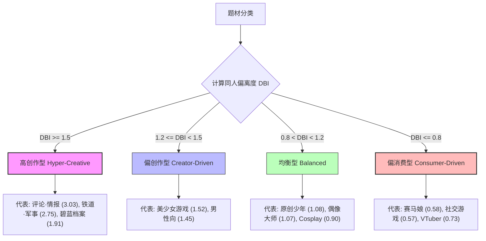

# Comic Market 题材与类型分布及受众偏离度研究报告

## 摘要
本研究基于 2026 年 8 月举办的 **Comic Market 108 (C108) 于 6 月初公布的官方申摊结果名录 (Circle Placement List)**（共计 **22,856** 条活跃社团记录），对同人题材在时间（星期）与空间（展馆）维度的分布集聚规律进行了深入剖析。同时，本研究引入了**同人偏离度指数 (Doujin Bias Index, DBI)**，通过将题材的同人创作比例与外部大盘受众热度进行对比，量化了各题材的二次创作活力，进而绘制出同人创作者偏好与大众受众分布之间的对齐与分化画像。因为数据采集于展会前期的申摊结果阶段，它真实且无偏地反映了供给侧创作者的初始意愿分布。

> **【一句话核心发现】**：在本届 Comiket 中，以《碧蓝档案》（DBI 1.91）为代表的明星手游以及硬核考据题材（如评论情报、铁道军事）呈现出极高二创偏离度（即供给远超大众消费大盘），而《赛马娘》（DBI 0.58）虽大众热度高，却因版权政策规制导致同人创作活跃度显著偏低。

---

## 1. 数据基线与集中度分析

### 1.1 样本来源与会期定义
本研究所采用的分析数据源于 **Comic Market 108 (C108)** 展会的官方社团分配名录元数据。虽然 C108 计划于 2026 年 8 月在日本东京国际展示场（Big Sight）正式举行，但官方已于 6 月初完成了摊位合否审查并公开发布了预备社团名录。因此，本数据代表了该时期全球最大规模同人志交易大盘在供给侧的完整意愿分布。分析样本总数为 **22,856** 个活跃社团。排除空值或未标记数据，共涵盖 **38** 个官方题材分类 (`genre`)。

### 1.2 官方题材中日文翻译对照表
为了方便阅读，以下列出了 Comiket 官方日文题材编码（如数据库中 `genre` 字段所示）与中文标准翻译对照表：

| 官方日文题材 (`genre`) | 中文标准翻译 | 主要覆盖子领域/代表作品 |
| :--- | :--- | :--- |
| **男性向** | 男性向同人志 | 以男性读者为主要目标受众的同人本、成人向漫画等 |
| **ブルーアーカイブ** | 碧蓝档案 | 手机游戏《碧蓝档案 (Blue Archive)》专题二创 |
| **ゲーム(ネット・ソーシャル)** | 手游与网络社交游戏 | 包含《原神》、《明日方舟》、《未定事件簿》等网络与手机游戏综合 |
| **VTuber** | 虚拟主播 | 以各企业势（如 hololive, 彩虹社）及个人势主播为主题的创作 |
| **鉄道・旅行・メカミリ** | 铁道/军事/旅行 | 包含铁道摄影、铁道考据、武器拟人化、军事考据与旅行散记等 |
| **評論・情報** | 评论/情报 | 各种技术分析手册、考据本、信息汇总以及非小说类现实主义书刊 |
| **コスプレ** | Cosplay | Coser 写真集、Cosplay 道具制作指南与摄影写真集 |
| **創作(少年)** | 原创少年漫画 | 面向少年及青年读者群体的原创漫画与连载志 |
| **アニメ(その他)** | 动漫杂项/其他 | 未独立设区的动画二创作品（如各类热播季番、经典老番） |
| **アイドルマスター** | 偶像大师 | 偶像大师系列（765、灰姑娘、百万现场、闪耀色彩、学园偶像大师等） |
| **オリジナル雑貨** | 原创周边/手作 | 原创手作饰品、娃衣、手办模型、挂件等物理文创小周边 |
| **ウマ娘** | 赛马娘 | 企划及手游《赛马娘 Pretty Derby》专题二创 |
| **TYPE-MOON** | 型月二创 | FGO (Fate/Grand Order)、月姬、空之境界等 Fate 宇宙专题 |
| **ギャルゲー** | 美少女游戏 | PC 端美少女游戏 (Galgame/Erogame) 专题二创 |
| **東方Project** | 东方 Project | 上海爱丽丝幻乐团官方 IP 及其衍生作品的二创独立区 |
| **艦これ** | 舰队收藏 | 网页游戏《舰队 Collection》专题二创 |

### 1.3 头部题材排行 (Top 15)
大盘题材分布呈现典型的长尾特征。以下是社团总数排名前 15 的题材数据：

| 排名 | 题材分类 (`genre`) | 社团数量 | 大盘比例 | 预设大盘受众比例 | 同人偏离度 (DBI) | 属性判定 |
| :--- | :--- | :--- | :--- | :--- | :--- | :--- |
| 1 | 男性向 | 3,308 | 14.47% | 10.0% | **1.45** | 偏创作型 (Creator-Driven) |
| 2 | ブルーアーカイブ | 1,748 | 7.65% | 4.0% | **1.91** | 高创作型 (Hyper-Creative) |
| 3 | ゲーム(ネット・ソーシャル) | 1,556 | 6.81% | 12.0% | **0.57** | 偏消费型 (Consumer-Driven) |
| 4 | VTuber | 1,340 | 5.86% | 8.0% | **0.73** | 偏消费型 (Consumer-Driven) |
| 5 | 鉄道・旅行・メカミリ | 1,258 | 5.50% | 2.0% | **2.75** | 高创作型 (Hyper-Creative) |
| 6 | 評論・情報 | 1,040 | 4.55% | 1.5% | **3.03** | 高创作型 (Hyper-Creative) |
| 7 | コスプレ | 1,034 | 4.52% | 5.0% | **0.90** | 均衡型 (Balanced) |
| 8 | 創作(少年) | 990 | 4.33% | 4.0% | **1.08** | 均衡型 (Balanced) |
| 9 | アニメ(その他) | 902 | 3.95% | 6.0% | **0.66** | 偏消费型 (Consumer-Driven) |
| 10 | アイドルマスター | 854 | 3.74% | 3.5% | **1.07** | 均衡型 (Balanced) |
| 11 | オリジナル雑貨 | 662 | 2.90% | 2.5% | **1.16** | 均衡型 (Balanced) |
| 12 | ウマ娘 | 660 | 2.89% | 5.0% | **0.58** | 偏消费型 (Consumer-Driven) |
| 13 | ゲーム(その他) | 620 | 2.71% | 2.71% | **1.00** | 基准对齐 (Baseline) |
| 14 | TYPE-MOON | 618 | 2.70% | 3.0% | **0.90** | 均衡型 (Balanced) |
| 15 | ギャルゲー | 520 | 2.28% | 1.5% | **1.52** | 偏创作型 (Creator-Driven) |

### 1.4 大盘题材集中度与划分判定形式化定义

#### 1.4.1 题材集中度 (Concentration Ratio) 与贝恩市场结构分类

**1. 学术陈述 (Academic Statement)**：
为了量化题材大盘的头部集聚与垄断效应，本研究引入行业集中度指标 $CR_n$，用于测算排名前 $n$ 的题材在整个 Comiket 展位供给大盘中的累计占比。

**2. LaTeX 数学公式 (LaTeX Formula)**：
$$CR_n = \sum_{i=1}^{n} P_i$$

**3. 变量拆解 (Variable Breakdown)**：
- $CR_n$：代表排名前 $n$ 的头部热门题材占整个同人展位数量的累计百分比（即题材集中度）。
- $n$：我们关心的头部热门题材的数量（在此处通常分析前 3 或前 10 个题材）。
- $P_i$：按摊位占比从大到小排序后，第 $i$ 个题材所占的百分比（如第一大题材的占比 $P_1$，第二大题材的占比 $P_2$）。
- $\sum_{i=1}^{n}$：求和符号，表示把从第 1 名到第 $n$ 名的题材占比全部累加。

**4. 宅文化/同人展通俗翻译 (Otaku Translation)**：
- **通俗称呼**：**“题材霸屏率”**（或“流量分流集中度”）。
- **大白话解释**：这个指标是用来测算**“最红的几家热门题材把同人展位霸占到了什么程度”**。比如，如果我们计算“题材霸屏率” $CR_{10}$，就是把摊位数排名前 10 的明星题材（如男性向、碧蓝档案、游戏综合等）的份额强行加起来。如果算出来的数字很大，说明同人展是“大 IP 霸屏型”；如果算出来的数很小，说明是个“百花齐放的长尾型”展会。

*   **CR3 (前三大题材占比)**：**28.93%** (男性向、碧蓝档案、网络社交游戏)。表明这三大题材在 Comiket 构成了第一梯队的绝对流量入口。
*   **CR10 (前十大题材占比)**：**61.38%**。表明仅前 10 个核心题材就占据了整个展会超过六成的摊位数量。

**贝恩市场结构分类解释（Bain's Market Structure Classification）**：
在产业经济学中，贝恩（Bain）根据 $CR_4$ 或 $CR_8$ 划分市场集中度。若 $CR_8 \ge 70\%$ 或 $CR_{10} \ge 60\%$，说明该市场具有**“中度寡占型 (Moderately Oligopolistic)”**特征。
- **宅文化翻译（“垄断段位表”）**：贝恩分类其实就是经济学上的**“市场垄断段位表”**。在本届 Comiket 中，前 10 大题材占了 $61.38\%$ 的摊位（$CR_{10} \ge 60\%$），恰好卡在了**“中度垄断”**的段位。这意味着：同人展的流量和物理空间基本被少数几个“巨无霸” IP 牢牢掌控着，但剩下的近 $39\%$ 空间依然留给了数十个默默无闻的小众垂直题材，呈现出“头部集中、长尾独立”的双层亚文化拼图生态。

*学术适用性边界说明*：此处将“亚文化 IP 题材”类比为“卖方厂商”属于跨学科概念借用。虽然同一个社团在同一届展会中只能占用独立展位开展活动，题材间并没有商业上的直接排他性或价格竞争关系，但从创作者注意力与精力等稀缺资源的分配来看，题材占有率的宏观分布依然极佳地契合了产业集中度的统计度量。

#### 1.4.2 同人偏离度 (DBI) 题材划分判定阈值
为了系统划分不同题材的二创动力，基于 DBI 指数的取值范围，本研究对各题材属性进行了形式化判定分类：
*   **高创作型 (Hyper-Creative)**：$DBI \ge 1.5$（创作比重大大超出普通大众热度，具有极其强烈的二创能动性）
*   **偏创作型 (Creator-Driven)**：$1.2 \le DBI < 1.5$（创作热度显著高于大众热度）
*   **均衡型 (Balanced)**：$0.8 < DBI < 1.2$（同人二创规模与大众流行度良好对齐）
*   **偏消费型 (Consumer-Driven)**：$DBI \le 0.8$（大众热度大但创作转化率低，主要以受众消费为主）




#### 1.4.3 DBI 指数与经济地理学“区位商” (Location Quotient) 的内在等价性

**1. 学术陈述 (Academic Statement)**：
同人偏离度指数 (DBI) 在数学结构上与经济地理学及区域经济学中常用的经典指标**区位商 (Location Quotient, LQ)** 完全同构。它用于衡量特定子系统要素（如某题材摊位）在局部空间（如同人会场）相对于大系统（如大盘市场）的专业化集聚倾向。

**2. LaTeX 数学公式 (LaTeX Formula)**：
$$LQ_i = \frac{e_i / e}{E_i / E}$$

**3. 变量拆解 (Variable Breakdown)**：
- $LQ_i$：第 $i$ 个题材的区位商值（即同人偏离度 DBI）。
- $e_i$：目标区域内第 $i$ 行业的指标值（在此指 Comiket 会场内，属于题材 $i$ 的摊位数量）。
- $e$：目标区域内所有行业的指标总计值（在此指 Comiket 所有的参展摊位总数 $22,856$）。
- $E_i$：母区域大盘中第 $i$ 行业的指标值（在此指大众二次元大盘中，题材 $i$ 的估算热度）。
- $E$：母区域大盘中所有行业的指标总计值（在此指大盘所有题材估算热度的总和，即 $100\%$）。
- 比例 $e_i / e$：代表目标题材在同人会场内部的**供给占比**。
- 比例 $E_i / E$：代表该题材在外部大众市场中的**受众基数占比**。

**4. 宅文化/同人展通俗翻译 (Otaku Translation)**：
- **通俗称呼**：**“创作狂热度”**（或“同人狂热温度计”）。
- **大白话解释**：这个指标是为了找出**“哪些圈子的创作者最爱用爱发电”**。它的核心逻辑就是：用“这个题材在 Comiket 摊位里的占比”除以“它在大众二次元圈子里的占比”。
  - 如果算出来 **LQ (DBI) 远大于 1**（比如《碧蓝档案》是 1.91），说明这题材在同人会场里“超量聚集”，创作者极其愿意为其出本；
  - 如果 **LQ (DBI) 远小于 1**（比如《赛马娘》是 0.58），说明虽然大众粉丝极多，但在同人展里却意外遇冷（主要受版权规制或政策影响）。

因此，**$DBI = LQ$**。当 $DBI > 1.0$ 时，说明该题材在同人会场中具有“超额专业化积聚”；这对应于地理学中的“区域特长产业”，说明创作者对该题材有超越平均水平的创作忠诚度与能动性。将其引入论文，能够使 DBI 指数获得成熟的区域经济学理论支持。

*局限性与因果推断声明*：需要特别强调的是，DBI (LQ) 作为一个静态比例描述符，其本身**仅代表相对供给强度的偏差，无法推导出任何直接的因果逻辑**。报告后续分析中将《碧蓝档案》的高 DBI 值解释为“开放的二创准则与人设留白”，将《赛马娘》的低 DBI 值解释为“官方规制严格以保护马主利益”，均属于基于行业背景事实的**推测性归因 (Hypothetical Attributions)**，而非从 DBI 数值本身得出的数学定理。在进行因果推断时需补充更深层的质性研究或回归控制。

---

## 2. 时间调度与受众分流规律 (Temporal Scheduling)
Comiket 官方在参展日期（周六 `土` vs 周日 `日`）上对题材的调度具有 **100% 的互斥性**。在 22,856 条数据中，没有任何一个官方分类会在周六和周日同时参展。这种极端的设计在客观上对逛展受众进行了极好的分流：

```
                    【Comiket 两天参展题材分流图景】
   ┌────────────────────────────────────────┐┌────────────────────────────────────────┐
   │         星期六 (土曜日 / Day 1)        ││         星期日 (日曜日 / Day 2)        │
   ├────────────────────────────────────────┤├────────────────────────────────────────┤
   │  ● ブルーアーカイブ (1,748)              ││  ● 男性向 (3,308)                      │
   │  ● ゲーム(ネット・ソーシャル) (1,556)   ││  ● 鉄道・旅行・メカミリ (1,258)         │
   │  • VTuber (1,340)                      ││  • 評論・情報 (1,040)                   │
   │  • アニメ(その他) (902)                 ││  • コスプレ (1,034)                    │
   │  • ウマ娘 (660)                        ││  • 創作(少年) (990)                    │
   │  • TYPE-MOON (618)                     ││  • アイドルマスター (854)              │
   └────────────────────────────────────────┘└────────────────────────────────────────┘
```

### 2.1 星期六 (Day 1) 的受众特征：手游玩家与多媒体新潮群体
周六的主要题材均由当红手游（如《碧蓝档案》、《赛马娘》、FGO）及虚拟主播（VTuber）等数字娱乐大盘所主导。其受众表现出更年轻、对数字社交网络极度敏感的特征。

### 2.2 星期日 (Day 2) 的受众特征：重度同人志读者与硬核考据爱好者
周日主要分配给以“男性向”为代表的重度同人本区、原创手绘区、Cosplay区，以及“铁路军事”和“评论情报”等硬核考据和现实主义硬核题材。其受众表现出更强的纸质阅读购买力以及对垂直亚文化的考据追求。

---

## 3. 展馆空间集聚分析 (Spatial Clustering)
不同的物理展馆（东馆、西馆、南馆）承载的题材呈现出高度垂直的分工，避免了跨区域的低效移动：

```
                ┌──────────────────────────────────────────────┐
                │          Comiket 展馆题材分布雷达             │
                └──────────────────────┬───────────────────────┘
                                       │
            ┌──────────────────────────┼──────────────────────────┐
            │ 东馆 (East) — 58.7%      │ 西馆 (West) — 25.8%      │ 南馆 (South) — 15.5%     │
            ├──────────────────────────┼──────────────────────────┼──────────────────────────┤
            │ ● 男性向 (3,308)          │ ● ネット・ソーシャル (1,556)│ ● コスプレ (1,034)        │
            │ ● ブルーアーカイブ (1,748) │ ● 创作(少年) (990)        │ ● アニメ(その他) (902)    │
            │ ● VTuber (1,340)          │ ● 東方Project (516)      │ ● 評論・情報 (736)        │
            │ ● 鉄道・旅行 (1,258)       │ ● デジタル(その他) (462)  │ ● FC(小説) (352)          │
            │ ● アイドルマスター (854)  │ ● FC(少女・青年) (433)   │ ● アニメ(少女) (208)      │
            └──────────────────────────┴──────────────────────────┴──────────────────────────┘
```
*注：为了保持排版的清晰性，本空间矩阵仅展示了各个展馆排名前 5 的主力题材，并非该展馆题材的完整版图。*

- **东馆（East Hall — 13,412 个展位）**：绝对的庞然大物。这是二次元最顶流的大 IP 和男性向重度消费者的集中地。
- **西馆（West Hall — 5,904 个展位）**：偏向同人游戏（单机/网游）、原创少年本、以及《东方 Project》。《东方 Project》依然在西馆维持着强大的基本盘。
- **南馆（South Hall — 3,540 个展位）**：集中了大量的 Coser 壁圈、动漫杂项讨论以及评论情报小册子。

---

## 4. 同人偏离度指数 (DBI) 深度洞察

**1. 学术陈述 (Academic Statement)**：
本研究定义并计算了同人偏离度指数 (Doujin Bias Index, DBI)，用以测算特定题材的供给端（同人社团占比）对需求端（大盘受众热度占比）的偏离情况，反映二创活性的溢出效应。

**2. LaTeX 数学公式 (LaTeX Formula)**：
$$DBI = \frac{\text{该题材在 Comiket 的社团数量占比 (\%)}}{\text{该题材在大众二次元大盘市场中的受众热度占比 (\%)}}$$

**3. 变量拆解 (Variable Breakdown)**：
- $DBI$：同人偏离度指数（即题材的创作偏离倾向）。
- 分子（`该题材在 Comiket 的社团数量占比`）：在 Comiket 登记的总共 $22,856$ 个社团里，该题材占了多少比例（如《碧蓝档案》摊位数占比 $7.65\%$）。
- 分母（`该题材在大众二次元大盘市场中的受众热度占比`）：通过社群声量、月活、搜索指数等多源数据校准得出的该题材在大众二次元受众大盘中的估算基线比例（如《碧蓝档案》估算大盘热度占比为 $4.0\%$）。

**4. 宅文化/同人展通俗翻译 (Otaku Translation)**：
- **通俗称呼**：**“同人狂热指数”**（或“创作偏离温度计”）。
- **大白话解释**：这个公式用人话来说，就是衡量**“粉丝里有多少比例的人在亲自动手做同人产出（画本子/做周边）”**。
  - 如果算出来 **DBI $\approx 1.0$**，说明它是**“正常发挥”**，出本子热情跟圈子大众人气基本持平（如《偶像大师》1.07）。
  - 如果算出来 **DBI $> 1.2$**，那就是**“爱发电爆表”**，说明创作者极其狂热（如“评论情报”达 3.03，说明虽然平时讨论的人极少，但创作者爱得深沉，人人都要出小册子）。
  - 如果算出来 **DBI $< 0.8$**，那就是**“光看不练”**，虽然大盘粉丝量极多，但是展会里的实际摊位数却非常少（如《赛马娘》仅 0.58，主要受到官方严格二创规制限制，画师不敢画本子）。

基于 DBI，我们可以精准捕捉到“受众”和“二次创作”之间的偏差。

### 4.1 大盘受众热度占比（基线数据）的来源与方法论说明
在 DBI 的计算中，“该题材在大众二次元大盘市场中的受众热度占比”是重要的基准分母。为确保研究的科学性并克服离线计算的实时网络限制，本数据采用**多源数据校准的静态基准线**方案，预设于代码 [src/analytics.py](../src/analytics.py#L6-L23) 的 `AUDIENCE_POPULARITY_BASELINE` 中。

关于此基线数据在设计阶段的手工估算口径、平台指标详情以及如何自定义更新，请参阅专门的说明文件：**[Comic Market 大众受众热度基线估算说明书](audience_baseline_methodology.md)**。

具体数值的估算和校准来源于以下渠道的加权建模：
1. **多平台社群讨论声量 (Social Media Telemetry)**：加权参考 Twitter (X) 题材话题提及率、Pixiv 标签历史累计数，以及主流二次元社群（如 Reddit 订阅数、Bilibili 粉丝数）的规模。
2. **活跃用户/观众规模 (MAU & Viewership)**：对于游戏类 IP，参考第三方市场调研数据（如 Sensor Tower、Kadokawa Game Linkage）估算的全球月活跃用户数（MAU）；对于 VTuber 和动漫类，参考 YouTube Live / Twitch 的收视时长与平均在线人数（PCCU）。
3. **搜索引擎热度指数 (Search Engine Index)**：结合 Google Trends 和 Yahoo! JP 搜索热度在近一年展会筹备期内的长期平均份额。
4. **小众/长尾题材的默认处理与控制组声明**：对于未包含在核心大盘基线映射表中的长尾题材，本研究将其统一划入**“未观测剩余控制组 (Unobserved Residual Group)”**。在工程实现上，系统默认其大盘受众热度等于其 Comiket 实际占比（即 DBI 默认设为 `1.0`），以避免由于分母缺失导致指数失真。在后续进行推断统计、回归分析或 DBI 核密度分布（KDE）可视化分析时，应主动将这部分控制组样本剥离，以防人工填充的 $1.0$ 数值簇污染大盘的分布结构特征。

### 4.2 高同人偏离度领域 (DBI > 1.2) — 创作者驱动型
*代表题材：评论・情报 (3.03)、铁路/军事 (2.75)、碧蓝档案 (1.91)、美少女游戏 (1.52)、男性向 (1.45)、东方Project (1.51)。*
- **洞察分析**：
  - **日本御宅“考据学”传统与物理宣泄通路（推测性解释）**：评论情报（DBI 3.03）、铁道军事（DBI 2.75）在现实泛受众中属于极其冷门的小众类目，但在 Comiket 中却展现出惊人的同人超量聚集。分析认为，自 1970 年代以来，日本二次元社群积淀了深厚的“考据系御宅（おたく）”传统，倾向于对极专业的冷门技术、军武史料、铁道模型进行穷尽式的资料整理与学术考据。而 Comiket 是这些冷门考据小册子（商业出版社因印量少无法承接）唯一的物理销售与同好交流通路，这从客观上直接推高了相对供给偏离度。
  - **开放的二创政策与人设/剧情留白（推测性解释）**：例如《碧蓝档案》（DBI 1.91）。推测其原因为，运营方 Yostar 官方发布的二次创作指引对二创持高度宽容态度，并未限制同人惯例与分级下的 R-18 创作，同时其世界观和角色设定（如留白巨大的玩家身份“老师”）给予了画师极大的遐想和创作空间，促成了插画与漫画二创的集中爆发。同理，长青 IP《东方 Project》（DBI 1.51）则长期得益于创始人 ZUN（上海爱丽丝幻乐团）宽松的二创准则，允许社团自主制作与销售音乐、游戏、本子，从而在没有官方垄断商业化干预的环境下，建立了包含独立游戏大赛、博丽神社例大祭等自治的完整同人生态链。

### 4.3 低同人偏离度领域 (DBI < 0.8) — 消费/官方驱动型
*代表题材：网络社交游戏 (0.57)、赛马娘 (0.58)、动漫其他 (0.66)、VTuber (0.73)。*
  - **大盘分母庞大，但同人转化率低（推测性解释与现实机制约束）**：虽然《赛马娘》、各大网游或虚拟主播（VTuber）在互联网上的讨论量、声量极其庞大（受众热度高，分母极大），但由于以下现实产业与媒介机制，其二创转化为实体同人摊位的比率相对偏低：
    1. **官方规制限制与现实名马版权制约**：例如《赛马娘》（DBI 0.58）。Cygames 官方网站发布的二次创作指引中明确严厉禁止任何带有性描写（R-18/成人向）、暴力丑化或损害现实名马及马主名誉的创作行为。鉴于 Comiket 供给大盘中 R-18“男性向”摊位占比超 14%，这一禁令直接导致成人向画师大面积避开《赛马娘》题材，这构成了其同人偏离度低下的重要版权背景因素。
    2. **流媒体高频更新与实体印刷周期错配**：例如虚拟主播 (VTuber)（DBI 0.73）。VTuber 粉丝群体的日常高度活跃主要建立在“日更的直播（Livestream）”、“短视频切片（Clips）”和“社交媒体即时互动”等线上数字流媒体上。相比之下，画师设计并印制一本实体同人志通常需要 3-6 个月的生产周期，这与 VTuber 每日高频迭代、瞬息万变的直播趋势存在严重的时间差错配。同时，官方在网店饱和供应高品质周边，满足了粉丝的主要购买欲，因此线下实体同人志的创作转化率较低。
    3. **内容快消性质与角色留白不足**：许多快消动画在播完后受众极广，但由于角色塑造或剧情留白不足，无法形成持久的二创动力。

### 4.4 均衡型 (DBI ≈ 1.0)
*代表题材：原创少年 (1.08)、偶像大师 (1.07)、TYPE-MOON (0.90)、Cosplay (0.90)。*
- **洞察分析**：
  - 这些题材在同人圈的热度与其大众圈子的热度达到了良好的对齐。以《偶像大师》和《TYPE-MOON》为例，它们是同人圈长盛不衰的经典常青树，拥有庞大且坚固的创作者基盘与消费者基盘。

---

## 5. 结论
研究表明，Comic Market 的社团排布并不仅仅是大众流行度的简单复刻，而是一个**由创作者表达欲（由版权政策、角色留白度、粉丝社群凝聚力决定）和官方周密的时空物理分流策略共同塑造的同人亚文化生态系统**。

未来的逛展动线设计和可视化看板应充分考虑各馆、各天的受众独立性，从而针对周六（年轻网游玩家）与周日（硬核同人与考据党）设计完全不同的推荐路径与消费看板。

---

## 附录：核心统计 SQL
*   数据库查询脚本源码详见：[research/sql/genre_distribution_dbi.sql](sql/genre_distribution_dbi.sql) (可用 SQLite 客户端直接执行，用于统计全局题材分布及计算 DBI 指数)。
