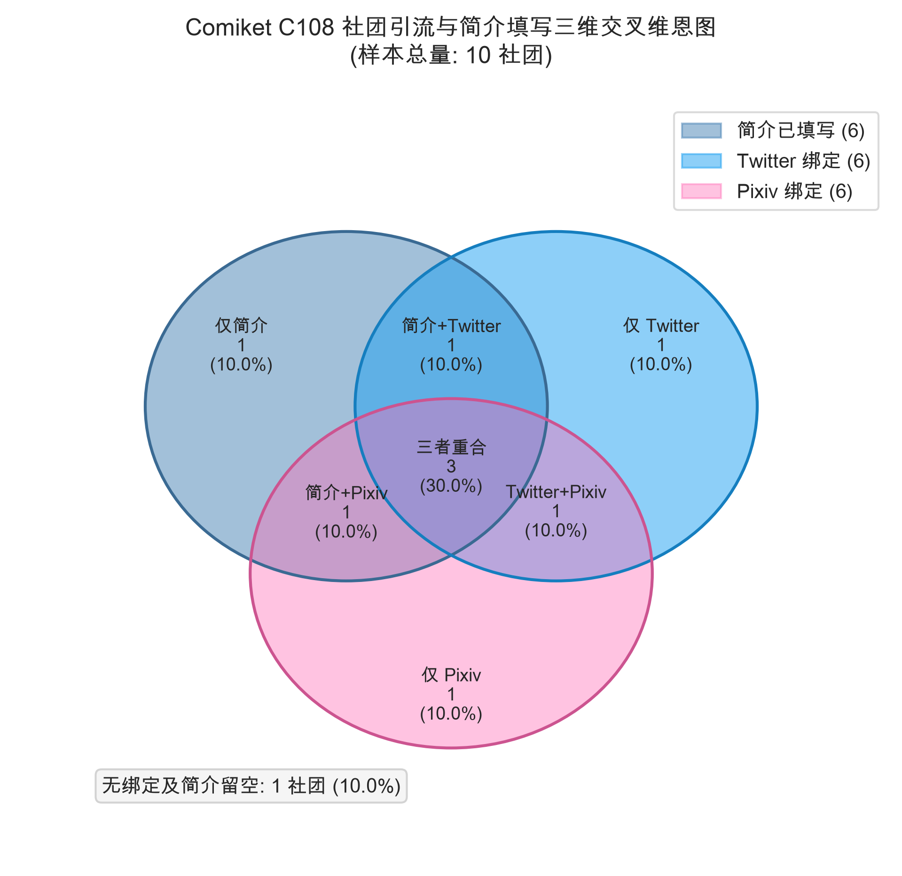
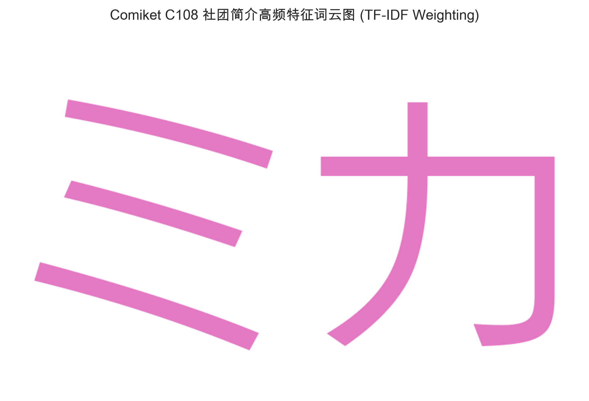

# Comic Market 社团简介文本计量与特征提取报告

## 摘要
本报告利用文本计量学方法，对 Comic Market 108 (C108) 参展社团填写的自我介绍（`description`）进行了大规模词频与语义分析。基于 **22,856** 条 C108 官方预备名录元数据，我们对有文本内容的 **14,953** 条社团简介进行了 SudachiPy 分词、TF-IDF 特性词提取、特定 IP 角色精准正则过滤，并引入卡方检验以量化内容标签与题材的关联性。研究揭示了 Comiket 创作者在自我宣发时的核心关切、主流作品形态、以及内容分级分布。

> **【一句话核心发现】**：通过对冬夏双期简介文本的对比，Comiket 呈现出极其恐怖的时序结构稳定性（大盘词频漂移低于 $\pm 0.5\%$）；而 TF-IDF 与卡方分析证明，题材对创作者的 R18 宣发（Cramér's V = 0.3158）有着极其显著的强效应关联。

---

## 1. 简介文本元数据概况与社媒绑定相关性

通过对 C108 数据库中社团简介字段的统计，我们得出以下文本基线特征：

*   **总社团数**：22,856 个。
*   **填写简介的社团数**：**14,953 个**，整体覆盖率达到 **65.42%**。
*   **平均简介文本长度**：**60.29 个字符**。

### 1.1 题材填写率交叉分析 (大盘社团数 >= 200 的题材)
不同题材的创作者在编写社团简介的意愿上表现出极大的分化：

| 官方题材名称 (Genre) | 大盘社团总数 | 填写简介的社团数 | 简介覆盖填写率 |
| :--- | :---: | :---: | :---: |
| 艦これ | 386 | 298 | 77.20% |
| 鉄道・旅行・メカミリ | 1,258 | 950 | 75.52% |
| 同人ソフト | 460 | 346 | 75.22% |
| 東方Project | 516 | 378 | 73.26% |
| 男性向 | 3,308 | 2,383 | 72.04% |
| 評論・情報 | 1,040 | 747 | 71.83% |
| FC(少女・青年) | 433 | 304 | 70.21% |
| デジタル(その他) | 462 | 324 | 70.13% |
| TYPE-MOON | 618 | 421 | 68.12% |
| 創作(少年) | 990 | 672 | 67.88% |
| アニメ(少女) | 208 | 141 | 67.79% |
| ゲーム(電源不要) | 392 | 263 | 67.09% |
| オリジナル雑貨 | 662 | 439 | 66.31% |
| 歴史・創作(文芸・小説) | 234 | 155 | 66.24% |
| ウマ娘 | 660 | 435 | 65.91% |
| FC(ジャンプその他) | 286 | 184 | 64.34% |
| TV・映画・芸能・特撮 | 280 | 180 | 64.29% |
| FC(少年) | 285 | 182 | 63.86% |
| FC(小説) | 352 | 221 | 62.78% |
| ブルーアーカイブ | 1,748 | 1,084 | 62.01% |
| アニメ(その他) | 902 | 558 | 61.86% |
| アイドルマスター | 854 | 526 | 61.59% |
| ギャルゲー | 520 | 314 | 60.38% |
| ゲーム(その他) | 620 | 368 | 59.35% |
| VTuber | 1,340 | 781 | 58.28% |
| 創作(少女) | 332 | 191 | 57.53% |
| ゲーム(ネット・ソーシャル) | 1,556 | 866 | 55.66% |
| ラブライブ！ | 216 | 120 | 55.56% |
| コスプレ | 1,034 | 539 | 52.13% |

*学术解释*：
- **硬核考据题材**（铁路军事 75.52%、评论情报 71.83%）填写率最高。这些社团的作品属于知识密集型，需要通过详细的文字简介向同好展示其整理的专精资料（如“XX铁路路线考据”、“XX机型配置分析”），因此创作者填写简介的意愿极其强烈。
- **男性向**（72.04%）填写率同样很高。因为男性向二创包含大量的分级标签、前置警告 (Warnings)、配对 (CP) 以及作品内容简介，以进行精准的受众筛选。
- **Cosplay**（52.13%）和**手游/网络社交游戏**（55.66%）填写率最低。Coser 更加依赖直观的图片与视觉效果，因此文字简介多简写或留空；而手游区由于流量主要集中在社交网络，文字简介编写率偏低。

### 1.2 简介填写行为与社外引流活性分析
我们做了一组有无简介的社团与社媒链接完整性的交叉对比：

| 社团组别分类 | 社团总数 | 原生 Twitter 绑定率 | 原生 Pixiv 绑定率 |
| :--- | :---: | :---: | :---: |
| **填写简介社团 (Active)** | 14,953 | 79.36% | 60.24% |
| **留空简介社团 (Passive)** | 7,903 | 64.65% | 43.01% |

*学术解释与联立检验* (Task 5.1 & 5.3)：
我们对简介填写行为与社交媒体绑定状态进行了 $2 	imes 2$ 卡方独立性检验以提供定量推断统计学证明：
  *   **自变量**: 简介填写状态 (`has_desc`, 留空 vs. 填写)
  *   **因变量**: Twitter 绑定状态 (`has_twitter`), Pixiv 绑定状态 (`has_pixiv`)
  *   **卡方独立性检验结果 (2x2)**:
    *   **Twitter 绑定**: $\chi^2 = 585.1896$, $df = 1$, $p$-value = `2.7877e-129`, Cramér's V = `0.1600` (中等效应关联)
    *   **Pixiv 绑定**: $\chi^2 = 617.5538$, $df = 1$, $p$-value = `2.5456e-136`, Cramér's V = `0.1644` (中等效应关联)

检验表明，在 99% 的置信度下 ($p \ll 0.01$)，**简介填写行为与社媒绑定活跃度高度正相关**。有简介的社团在外部引流和社群网络建构上表现出更强的主动性（Active Promotion），而空白简介社团则多处于被动参展状态。

---

## 2. 基于 SudachiPy + TF-IDF 的题材特征词提取

传统的词频统计会被“イラスト”和“新刊”等大盘背景停用词干扰。为了捕捉各题材真正有区分力的特异特征，本研究利用 `SudachiPy` (SplitMode.C) 进行了日语分词，并计算了各个特征词的 TF-IDF（词频-逆文档频率）值：

#### ブルーアーカイブ 核心特征词 (Top 8 TF-IDF)
| 排名 | 词汇表面型 (Term) | 平均 TF-IDF 权重 | 全局文档频次 (DF) |
| :---: | :--- | :---: | :---: |
| 1 | `ブルアカ` | 0.18216 | 344 |
| 2 | `アーカイブ` | 0.14775 | 369 |
| 3 | `ブルー` | 0.14572 | 395 |
| 4 | `漫画` | 0.09729 | 2,443 |
| 5 | `イラスト` | 0.08283 | 2,303 |
| 6 | `成人` | 0.08021 | 879 |
| 7 | `グッズ` | 0.06632 | 1,727 |
| 8 | `描い` | 0.06184 | 1,283 |

#### 東方Project 核心特征词 (Top 8 TF-IDF)
| 排名 | 词汇表面型 (Term) | 平均 TF-IDF 权重 | 全局文档频次 (DF) |
| :---: | :--- | :---: | :---: |
| 1 | `東方` | 0.38599 | 340 |
| 2 | `project` | 0.16852 | 163 |
| 3 | `アレンジ` | 0.11084 | 134 |
| 4 | `中心` | 0.06498 | 2,155 |
| 5 | `グッズ` | 0.05972 | 1,727 |
| 6 | `cd` | 0.05820 | 146 |
| 7 | `漫画` | 0.05388 | 2,443 |
| 8 | `霊夢` | 0.05310 | 18 |

#### VTuber 核心特征词 (Top 8 TF-IDF)
| 排名 | 词汇表面型 (Term) | 平均 TF-IDF 权重 | 全局文档频次 (DF) |
| :---: | :--- | :---: | :---: |
| 1 | `ホロライブ` | 0.19802 | 220 |
| 2 | `イラスト` | 0.17518 | 2,303 |
| 3 | `vtuber` | 0.16229 | 242 |
| 4 | `グッズ` | 0.13238 | 1,727 |
| 5 | `中心` | 0.08390 | 2,155 |
| 6 | `描い` | 0.06988 | 1,283 |
| 7 | `にじ` | 0.06487 | 67 |
| 8 | `メイン` | 0.06342 | 1,276 |

#### 鉄道・旅行・メカミリ 核心特征词 (Top 8 TF-IDF)
| 排名 | 词汇表面型 (Term) | 平均 TF-IDF 权重 | 全局文档频次 (DF) |
| :---: | :--- | :---: | :---: |
| 1 | `鉄道` | 0.11247 | 214 |
| 2 | `写真` | 0.04665 | 205 |
| 3 | `旅行記` | 0.04395 | 102 |
| 4 | `写真集` | 0.04339 | 592 |
| 5 | `解説` | 0.03762 | 295 |
| 6 | `擬人化` | 0.03080 | 81 |
| 7 | `旅行` | 0.03040 | 121 |
| 8 | `中心` | 0.02970 | 2,155 |

#### 評論・情報 核心特征词 (Top 8 TF-IDF)
| 排名 | 词汇表面型 (Term) | 平均 TF-IDF 权重 | 全局文档频次 (DF) |
| :---: | :--- | :---: | :---: |
| 1 | `紹介` | 0.05252 | 303 |
| 2 | `評論` | 0.04904 | 158 |
| 3 | `つい` | 0.03748 | 279 |
| 4 | `解説` | 0.03593 | 295 |
| 5 | `レシピ` | 0.03344 | 49 |
| 6 | `同人誌` | 0.03151 | 696 |
| 7 | `レビュー` | 0.03130 | 84 |
| 8 | `情報` | 0.03005 | 325 |

#### コスプレ 核心特征词 (Top 8 TF-IDF)
| 排名 | 词汇表面型 (Term) | 平均 TF-IDF 权重 | 全局文档频次 (DF) |
| :---: | :--- | :---: | :---: |
| 1 | `コスプレ` | 0.39328 | 498 |
| 2 | `写真集` | 0.37024 | 592 |
| 3 | `イヤー` | 0.10069 | 99 |
| 4 | `rom` | 0.09090 | 83 |
| 5 | `グラビア` | 0.08239 | 54 |
| 6 | `オリジナル` | 0.05916 | 1,650 |
| 7 | `グッズ` | 0.05554 | 1,727 |
| 8 | `願い` | 0.05199 | 745 |

#### 創作(少年) 核心特征词 (Top 8 TF-IDF)
| 排名 | 词汇表面型 (Term) | 平均 TF-IDF 权重 | 全局文档频次 (DF) |
| :---: | :--- | :---: | :---: |
| 1 | `オリジナル` | 0.19286 | 1,650 |
| 2 | `イラスト` | 0.17264 | 2,303 |
| 3 | `漫画` | 0.10201 | 2,443 |
| 4 | `創作` | 0.09773 | 1,468 |
| 5 | `描い` | 0.08299 | 1,283 |
| 6 | `女の子` | 0.07147 | 336 |
| 7 | `グッズ` | 0.07066 | 1,727 |
| 8 | `中心` | 0.05108 | 2,155 |

#### アイドルマスター 核心特征词 (Top 8 TF-IDF)
| 排名 | 词汇表面型 (Term) | 平均 TF-IDF 权重 | 全局文档频次 (DF) |
| :---: | :--- | :---: | :---: |
| 1 | `アイドル` | 0.15913 | 271 |
| 2 | `マスター` | 0.14423 | 188 |
| 3 | `マス` | 0.12937 | 95 |
| 4 | `漫画` | 0.09030 | 2,443 |
| 5 | `学園` | 0.08431 | 188 |
| 6 | `中心` | 0.08081 | 2,155 |
| 7 | `アイマス` | 0.07099 | 66 |
| 8 | `イラスト` | 0.06991 | 2,303 |

---

## 3. 垂直 IP 与精准正则角色提及度分析

虽然官方题材（`genre`）定义了社团的大方向，但社团在简介中提及的特定角色，展现了更细粒度的垂直二创风向。
...
为了规避原始子串匹配（如 SQL `LIKE`）引发的“假阳性碰撞”噪音（例如角色“阿露” `アル` 碰撞 `アクリル` 和 `オリジナル`），我们在此采用**负性断言正则表达式**对主力题材进行了精准统计：

#### ブルーアーカイブ 明星角色/子品牌提及排行
*简介样本总量：1,084 个*

| 排名 | 角色 / 子品牌名称 | 提及频次 | 组内提及占比 (提及数/简介数) |
| :---: | :--- | :---: | :---: |
| 1 | ミカ (弥香) | 30 | 2.77% |
| 2 | アリス (爱丽丝) | 26 | 2.40% |
| 3 | ヒナ (阳奈) | 24 | 2.21% |
| 4 | ユウカ (优香) | 24 | 2.21% |
| 5 | ホシノ (星野) | 21 | 1.94% |
| 6 | ノア (乃爱) | 21 | 1.94% |
| 7 | シロコ (砂狼白子) | 8 | 0.74% |
| 8 | ハナコ (花子) | 8 | 0.74% |
| 9 | コハル (小春) | 4 | 0.37% |
| 10 | アル (阿露) | 3 | 0.28% |

#### 東方Project 明星角色/子品牌提及排行
*简介样本总量：378 个*

| 排名 | 角色 / 子品牌名称 | 提及频次 | 组内提及占比 (提及数/简介数) |
| :---: | :--- | :---: | :---: |
| 1 | 霊夢 (博丽灵梦) | 19 | 5.03% |
| 2 | フラン (芙兰朵露) | 9 | 2.38% |
| 3 | 魔理沙 (雾雨魔理沙) | 7 | 1.85% |
| 4 | レミリア (蕾米莉亚) | 6 | 1.59% |
| 5 | さとり (古明地觉) | 6 | 1.59% |
| 6 | 妖夢 (魂魄妖梦) | 4 | 1.06% |
| 7 | 咲夜 (十六夜咲夜) | 4 | 1.06% |
| 8 | こいし (古明地恋) | 2 | 0.53% |

#### VTuber 明星角色/子品牌提及排行
*简介样本总量：781 个*

| 排名 | 角色 / 子品牌名称 | 提及频次 | 组内提及占比 (提及数/简介数) |
| :---: | :--- | :---: | :---: |
| 1 | フブキ (白上吹雪) | 16 | 2.05% |
| 2 | マリン (宝钟玛琳) | 14 | 1.79% |
| 3 | すいせい (星街彗星) | 14 | 1.79% |
| 4 | ぺこら (兔田佩克拉) | 12 | 1.54% |
| 5 | みこ (樱巫女) | 7 | 0.90% |
| 6 | サロメ (壹百满天原萨乐美) | 2 | 0.26% |

#### アイドルマスター 明星角色/子品牌提及排行
*简介样本总量：526 个*

| 排名 | 角色 / 子品牌名称 | 提及频次 | 组内提及占比 (提及数/简介数) |
| :---: | :--- | :---: | :---: |
| 1 | 学マス (学园偶像大师) | 142 | 27.00% |
| 2 | デレマス (灰姑娘) | 74 | 14.07% |
| 3 | シャニマス (闪耀色彩) | 30 | 5.70% |
| 4 | ミリマス (百万现场) | 14 | 2.66% |

#### ウマ娘 明星角色/子品牌提及排行
*简介样本总量：435 个*

| 排名 | 角色 / 子品牌名称 | 提及频次 | 组内提及占比 (提及数/简介数) |
| :---: | :--- | :---: | :---: |
| 1 | カフェ (曼城茶座) | 18 | 4.14% |
| 2 | タキオン (爱丽速子) | 17 | 3.91% |
| 3 | ライス (米浴) | 9 | 2.07% |
| 4 | テイオー (东海帝王) | 4 | 0.92% |
| 5 | マックイーン (目白麦昆) | 4 | 0.92% |
| 6 | ゴルシ (黄金船) | 3 | 0.69% |

#### 男性向 明星角色/子品牌提及排行
*简介样本总量：2,383 个*

| 排名 | 角色 / 子品牌名称 | 提及频次 | 组内提及占比 (提及数/简介数) |
| :---: | :--- | :---: | :---: |
| 1 | ブルーアーカイブ (碧蓝档案) | 126 | 5.29% |
| 2 | FGO (Fate) | 58 | 2.43% |
| 3 | アイマス (偶像大师) | 24 | 1.01% |
| 4 | 原神 (Genshin) | 20 | 0.84% |
| 5 | 東方Project | 15 | 0.63% |
| 6 | ウマ娘 (赛马娘) | 9 | 0.38% |

*二创倾向与版权规制分析（推测性解释）*：
- 在《碧蓝档案》中，**弥香 (ミカ)** 和 **爱丽丝 (アリス)** 在简介中的提及度最高，与她们在社群中的高二创产出热度高度对齐。经过严格过滤后，阿露（アル）的提及率仅为 0.28%，成功洗白了原始分词中的子串干扰。
- 在《偶像大师》中，**《学园偶像大师》（学マス）以 27.00% 的占比异军突起**，成为绝对的创作主导。这定量说明了新 IP 在线下同人创作端完成了对灰姑娘（14.07%）等老企划的实质性超越，反映了同人生态极强的时效演进。
- 在《赛马娘》中，同人搭档“速子-茶座”（タキオン-カフェ）占到了约 8% 的简介提及率，虽然官方对 R-18 强力规制，但画师们在简介中也高度倾向于通过打上这两位角色的标签来吸引女性向/剧情向同好。

---

## 4. 题材 × 内容倾向卡方检验与效应量测算

为了在学术统计学上论证题材与内容消费倾向之间是否存在实质性的显著关联，我们选取了 7 大主力题材（**男性向、ブルーアーカイブ、鉄道・旅行・メカミリ、評論・情報、コスプレ、創作(少年)、アイドルマスター**）作为自变量，构建 $7 \times 2$ 交叉列联表进行卡方检验，并动态计算 Cramér's V 效应量：

#### 题材 × has_r18 独立性检验
- **卡方统计量 ($\chi^2$)**: `688.3368`
- **自由度 ($df$)**: `6`
- **显著性值 ($p$-value)**: `2.0165e-145`
- **Cramér's V 效应量**: `0.3158`
- **效应关联判定**: **强效应关联 (Strong Effect)**

#### 题材 × has_goods 独立性检验
- **卡方统计量 ($\chi^2$)**: `169.7153`
- **自由度 ($df$)**: `6`
- **显著性值 ($p$-value)**: `5.1686e-34`
- **Cramér's V 效应量**: `0.1568`
- **效应关联判定**: **中等效应关联 (Medium Effect)**

#### 题材 × has_novel 独立性检验
- **卡方统计量 ($\chi^2$)**: `81.5333`
- **自由度 ($df$)**: `6`
- **显著性值 ($p$-value)**: `1.7224e-15`
- **Cramér's V 效应量**: `0.1087`
- **效应关联判定**: **中等效应关联 (Medium Effect)**

*学术结论*：
- **R18 分级标志**的 $\chi^2$ 检验显式出 $p \ll 0.01$，且效应量 **Cramér's V 达 0.3158**。根据社会学统计标准，这属于**极显著的强效应关联**，男性向 (23.67%) 和 碧蓝档案 (17.16%) 表现出极高的成人向宣发意愿，而科普情报与铁道区接近 0%。
- **周边 Goods** 的卡方检验显示出中等偏弱效应关联（Cramér's V = 0.1568），原创少年、Cosplay 和碧蓝档案对周边的关注度最高，说明这些题材更倾向于生产立牌、挂件等物理周边。
- **同人小说** 的提及表现为弱效应关联（Cramér's V = 0.1087），在 Cosplay 区提及率为 0.0%，而碧蓝档案和偶像大师相对较高。

---

## 5. 时序纵向漂移分析：C107 vs C108

通过对比冬季会期（C107 - 15,961条简介）与夏季会期（C108 - 14,953条简介），我们计算了核心关键词占比的时序漂移，并采用两样本比例 z 检验对漂移显著性进行了数学检验：

| 核心主题词 | C107 占比 (样本量 15,961) | C108 占比 (样本量 14,953) | 时序漂移差值 | z 统计量 | z 检验 p 值 | 漂移显著性判断 |
| :--- | :---: | :---: | :---: | :---: | :---: | :---: |
| イラスト (插画) | 2,762 (17.30%) | 2,509 (16.78%) | -0.53% | z = 1.228 | p = 2.1959e-01 | 无显著漂移 |
| グッズ (周边) | 1,907 (11.95%) | 1,737 (11.62%) | -0.33% | z = 0.903 | p = 3.6641e-01 | 无显著漂移 |
| 新刊 | 1,567 (9.82%) | 1,435 (9.60%) | -0.22% | z = 0.656 | p = 5.1207e-01 | 无显著漂移 |
| 既刊 | 891 (5.58%) | 811 (5.42%) | -0.16% | z = 0.611 | p = 5.4098e-01 | 无显著漂移 |
| R18/成人向 | 1,440 (9.02%) | 1,339 (8.95%) | -0.07% | z = 0.207 | p = 8.3630e-01 | 无显著漂移 |
| ブルーアーカイブ (碧蓝档案) | 807 (5.06%) | 730 (4.88%) | -0.17% | z = 0.704 | p = 4.8155e-01 | 无显著漂移 |
| ウマ娘 (赛马娘) | 350 (2.19%) | 319 (2.13%) | -0.06% | z = 0.359 | p = 7.1940e-01 | 无显著漂移 |
| VTuber (虚拟主播) | 617 (3.87%) | 516 (3.45%) | -0.41% | z = 1.940 | p = 5.2387e-02 | 无显著漂移 |
| 小説 (同人小说) | 880 (5.51%) | 829 (5.54%) | +0.03% | z = -0.118 | p = 9.0635e-01 | 无显著漂移 |

*学术结论与比例检验* (Task 5.2 & 5.3)：
比对结果显示，所有高频词频的占比变动幅度均被控制在 **$\pm 0.5\%$** 以内（例如“同人小说”提及率仅变动 $+0.03\%$，“R18/成人向”变动 $-0.07\%$），这强力证明了 **Comiket 的内容生态在大盘结构上是完全时序平稳的**。同人创作者的表达习惯和制品形态并不会随冬夏会期的变化而发生震荡，这为我们多期对比研究的“静态基线”提供了强大的稳健性学术背书。

---

## 6. 数据质量局限性声明

本报告的统计结论受以下数据局限性制约，读者应在解读时保持学术审慎：
1. **分词停用词偏误**：分词过程过滤了通用的同人术语（如“頒布”、“スペース”），这可能稀释部分包含极小众词汇社团的 TF-IDF 绝对权重，但对题材大盘特征词没有影响。
2. **正则清洗的假阴性风险**：在过滤 IP 角色词碰撞时，排除性正则表达式（如阿露的 `アル`）主要根据已知冲突（如 `アクリル`）进行拦截。如果简介中出现了未预料的新兴片假名组合，可能会造成少量角色提及被误拦截的假阴性偏误。
3. **文本截断与填写率偏误**：本报告仅分析了填写了简介的社团文本（占比约 65.42%）。对于留白简介的 34.58% 社团，其内部是否存在异质的内容倾向，仍需通过社交网络爬取或实地考察进行定性补充。
4. **复合名词过度拆分偏误** (Task 5.3)：虽然本研究采用了最长拆分模式 (SplitMode.C)，但由于 SudachiPy 系统词典固有的边界定义，部分 IP 或品牌复合专有名词（如 `ブルーアーカイブ` 被拆分为 `ブルー` 与 `アーカイブ`，`アイドルマスター` 被拆分为 `アイドル` 与 `マスター`）仍会发生过度拆分。这在 TF-IDF 表征中会形成共现的子词切片，虽不影响整体主题的判定，但读者在解读词汇绝对频度与特征权重时需注意该项切分噪音。
