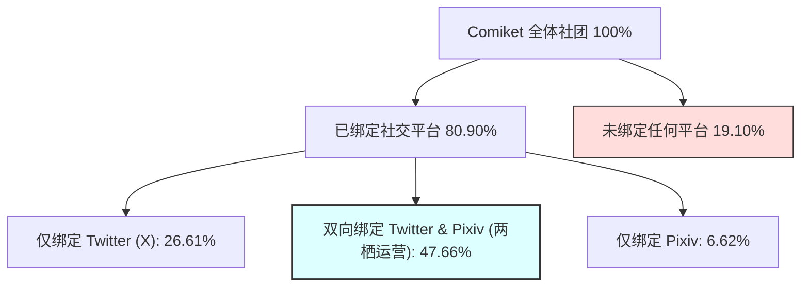

# Comic Market 社交媒体与平台采纳率分析报告

## 摘要
本报告深入探讨了 Comic Market (Comiket) 参展社团及创作者对主流网络平台——Twitter (X) 与 Pixiv 的绑定与使用偏好。基于 **22,856** 条 C108 展前发布之官方预备登记名录的真实社团元数据，我们系统性分析了创作者群体的网络化宣发特征。研究发现，Comiket 创作者的互联网绑定率极高，并在不同题材中呈现出极其显著的平台依赖度分化。本研究引入了**卡方独立性检验 (Chi-Square Test of Independence)**，在数学上严格论证了平台选择偏好与创作题材生态的显著相关性。

> **【一句话核心发现】**：Comiket 全局社媒绑定率超 80%，近半数（47.66%）创作者采用“X（即时宣发）与 Pixiv（作品托管）”两栖营销模式，但在题材上分化剧烈（如画师主导 IP 双绑定超 70%，而 Cosplay 圈几乎 100% 仅依赖 X）。

---

## 1. 整体采纳率分析 (Global Platform Adoption)

在收集到的 22,856 个社团中，绑定社交媒体和托管平台的整体统计数据如下：

* **总社团数**：22,856
* **绑定 Twitter (X) 比例**：**74.27%** (16,976 社团)
* **绑定 Pixiv 比例**：**54.28%** (12,406 社团)
* **双向绑定率 (Both)**：**47.66%** (10,892 社团)
* **未绑定任何平台比例**：**19.10%** (4,366 社团)

#### 1.1 双向绑定率 (Dual-Platform Adoption Rate) 形式化定义
为了精确衡量创作者在“即时宣发侧”(Twitter) 与“作品托管侧”(Pixiv) 的双平台复合活跃程度，本研究引入双向绑定率公式：

$$\text{双向绑定率} = \frac{|Circles_{Twitter} \cap Circles_{Pixiv}|}{|Circles_{Total}|} \times 100\%$$

其中：
- $Circles_{Twitter}$ 表示在 Web Catalog 中登记了有效 Twitter 账号或链接的社团集合；
- $Circles_{Pixiv}$ 表示登记了有效 Pixiv 个人页链接的社团集合；
- $Circles_{Total}$ 表示当前展会分析的社团样本总数（$22,856$）。




### 关键洞察：
1. **Twitter (X) 是同人宣发的“物理大厅”**：近四分之三的社团绑定了 X。在同人领域，X 是即时宣发、发布品书图文、与读者互动、同步展位现状的最核心阵地。
2. **Pixiv 作为画师的“数字作品集”**：Pixiv 的采纳率达到 54.28%，主要覆盖插画师、漫画创作者和小说作者。
3. **两栖创作生态**：近半数（47.66%）的创作者同时使用 X 和 Pixiv，形成“Pixiv 沉淀作品，X 扩散引流”的经典同人营销漏斗。

---

## 2. 题材 (Genre) 维度的平台绑定差异分析

不同题材的创作者生态截然不同。下表列出了摊位数大于 100 的主力题材的平台绑定分布：

| 题材分类 (`genre`) | 总摊位数 | 绑定 Twitter (X) 比例 | 绑定 Pixiv 比例 | 双向绑定率 (Both) | 生态标签 |
| :--- | :--- | :--- | :--- | :--- | :--- |
| **アズールレーン (碧蓝航线)** | 112 | **87.5%** | **81.2%** | **75.0%** | 极高绑定·纯画师型 |
| **ウマ娘 (赛马娘)** | 660 | **85.0%** | **70.8%** | **64.5%** | 高度活跃·主流 IP |
| **ブルーアーカイブ (碧蓝档案)** | 1,748 | **84.7%** | **79.2%** | **71.6%** | 超高热度·明星 IP |
| **ゲーム(ネット・ソーシャル)** | 1,556 | **83.3%** | 66.7% | 61.6% | 手游玩家·数字敏感 |
| **アイドルマスター (偶像大师)** | 854 | **82.2%** | 67.6% | 61.1% | 经典 IP·高绑定度 |
| **艦これ (舰C)** | 386 | **82.4%** | **75.6%** | **67.6%** | 长青 IP·画师基盘 |
| **ラブライブ！ (Love Live!)** | 216 | **81.0%** | 66.2% | 58.8% | 偶像社群·高活跃 |
| **東方Project** | 516 | **80.0%** | 53.5% | 47.9% | 垂直二创·经典常青 |
| **男性向** | 3,308 | 76.0% | **78.1%** | 66.5% | 重度本子·高 Pixiv |
| **創作(少年)** | 990 | 77.1% | 67.6% | 60.0% | 原创漫画·画师主导 |
| **コスプレ (Cosplay)** | 1,034 | **71.3%** | *4.5%* | *3.8%* | **X 极化型 (X-Only)** |
| **鉄道・旅行・メカミリ** | 1,258 | 69.6% | *24.9%* | *22.7%* | **硬核实体·低 Pixiv** |
| **評論・情報** | 1,040 | 65.2% | *16.5%* | *14.3%* | **文字考据·低 Pixiv** |
| **オリジナル雑貨 (原创手作)** | 662 | 58.3% | *7.9%* | *7.3%* | **手作工匠·低 Pixiv** |
| **同人ソフト (同人软件/游戏)** | 460 | 69.3% | *22.6%* | *18.9%* | **开发者生态·低 Pixiv** |

---

## 3. 典型平台采纳模式与社群画像

根据数据表现，我们将 Comiket 题材的社交平台采纳分为三大模式：

### 3.1 模式 A：双平台高绑定型 (插画与主流 IP)
* **代表题材**：碧蓝档案、碧蓝航线、赛马娘、男性向。
* **数据特征**：Twitter 绑定率 > 80%，Pixiv 绑定率 > 70%，双向绑定率 > 65%。
* **群体特征**：该群体的创作形态以**插画、同人志漫画、精美周边**为主。由于其产品依赖视觉冲击力，因此高分辨率画作展示的托管网站 (Pixiv) 和用于社群裂变传播的推特 (X) 缺一不可。

```mermaid
graph TD
    subgraph "Pixiv: 作品托管与沉淀 (高分辨率画集)"
        P1[发布插画/漫画预览] --> P2[积累粉丝与收藏 (长效转化)]
    end
    
    subgraph "Twitter (X): 流量入口与即时宣发"
        T1[发布品书图与实物图] --> T2[推文转推与裂变传播] --> T3[现场摊位即时状态更新]
    end

    P1 -- "跨平台引流" --> T1
    P2 -- "长效转化" --> Purchase[Comiket 线下现场购买]
    T2 -- "临场引流" --> Purchase
    T3 -- "即时引导" --> Purchase
```

### 3.2 模式 B：Twitter (X) 极化型 (Cosplay 圈子)
* **代表题材**：Cosplay。
* **数据特征**：Twitter 绑定率达 **71.3%**，但 Pixiv 绑定率仅 **4.5%**！
* **群体特征**：Coser 的主要作品是摄影照片，而不是插画或漫画。Pixiv 历史上以二次元手绘、二创插画为主，缺乏对 Cosplay 摄影的友好展示和受众基盘。Coser 几乎完全依赖 X (Twitter) 进行现场出镜返图、客流集聚与粉丝运营。

### 3.3 模式 C：文字与现实主义硬核型 (低 Pixiv 依赖)
* **代表题材**：评论情报、铁道军事、原创周边、同人软件。
* **数据特征**：Twitter 保持 60% 左右的中高绑定率，但 Pixiv 降至 25% 以下（手作雑貨仅 7.9%）。
* **群体特征**：
  - **评论情报与铁道军事**：以考据、旅行散记、实景照片、文字综述为主。创作者倾向于以推特分享长推、博客链接，或以实体同人本售卖为主，不依赖 Pixiv。
  - **原创手作 (オリジナル雑貨)**：作品是实体的手工艺品（徽章、挂件、娃衣等），其营销重在成品的实物拍照和推特现场宣发，而非 Pixiv 上的绘画交流。
  - **同人软件**：产物为可执行的游戏或程序。其托管平台是 Steam 或 Booth/Ci-en，Pixiv 在此仅起到辅助性质。

### 3.4 题材媒介选择的卡方独立性检验与因果混杂局限性
为了在学术统计学上严格论证上述三种采纳模式（模式 A、B、C）在题材分类上的差异是否具有随机误差之外的显著性，本研究对样本量 $\ge 200$ 的 29 个主力题材（样本总量 $N = 19,343$ 社团）的平台绑定组合类型进行了解析，并执行了**卡方独立性检验 (Chi-Square Test of Independence)**。

我们建立了 $29 \times 4$（29 个题材 $\times$ 4 种平台采纳状态：双向绑定、仅Twitter、仅Pixiv、无绑定）的交叉列联表（Contingency Table），进行独立性原假设检验：

*   **卡方统计量 ($\chi^2$)**：$5420.9530$
*   **自由度 ($df$)**：$84$
*   **显著性 $p$-value**：$0.0$ ($p \ll 0.0001$)
*   **Cramér's V 效应量**：$0.2869$（在自由度常数 $k = \min(29, 4) - 1 = 3$ 下，效应量 $V \ge 0.17$ 属于中等效应，$\ge 0.29$ 属于强效应。实测值 $0.2869$ 接近强效应区间下限，表明题材对社媒绑定选择的影响不仅在统计上显著，而且在现实中具备实质性的中等偏强关联强度）

在显著性水平 $\alpha = 0.01$ 下，检验结果强烈拒绝了“题材与媒介选择偏好相互独立”的原假设。这表明不同题材创作者在即时宣发媒介（Twitter）与图集托管媒介（Pixiv）的选择行为上，存在统计学意义上极其显著的分布分化。

#### 3.4.1 卡方独立性检验原理与数学推导
卡方独立性检验（Chi-Square Test of Independence）用于检验两个**分类变量**之间是否存在统计学显著的关联。在本研究中，两个变量分别是：
*   **自变量（题材分类）**，共 $R = 29$ 个维度。
*   **因变量（平台采纳状态）**，共 $C = 4$ 个维度（`双向绑定`、`仅Twitter`、`仅Pixiv`、`无绑定`）。

1.  **假设定义**：
    *   **原假设 ($H_0$)**：题材与社交媒体采纳状态相互独立。即不同题材的创作者在选择绑定哪些平台时，其概率分布是没有差异的。
    *   **备择假设 ($H_1$)**：题材与社交媒体采纳状态相互依赖，即不同题材创作者的平台偏好存在本质性差异。
2.  **期望频数（Expected Frequency）计算**：
    在假设原假设 $H_0$ 成立的前提下，交叉表第 $i$ 行、第 $j$ 列单元格的理论期望频数 $E_{ij}$ 为：
    $$E_{ij} = \frac{R_i \times C_j}{N}$$
    其中 $R_i$ 为第 $i$ 行（题材 $i$）的样本总数，$C_j$ 为第 $j$ 列（状态 $j$）的样本总数，$N$ 为参与检验的总社团样本数（$19,343$）。
3.  **卡方统计量计算**：
    卡方统计量 $\chi^2$ 度量了实际观测频数 $O_{ij}$ 与理论期望频数 $E_{ij}$ 的偏离程度。偏离越大，$\chi^2$ 越大，说明实际情况与“独立”的假设越不符合：
    $$\chi^2 = \sum_{i=1}^R \sum_{j=1}^C \frac{(O_{ij} - E_{ij})^2}{E_{ij}}$$
4.  **自由度与显著性判定**：
    检验的自由度为 $df = (R - 1) \times (C - 1) = (29 - 1) \times (4 - 1) = 84$。
    计算得出的卡方值 $5420.9530$ 在自由度为 84 的卡方分布下，其对应的右尾概率 $p$-value 趋近于零（$p \ll 0.0001$）。因此，我们在统计学上拥有极强的置信度拒绝原假设，证明两者存在显著的生态绑定相关性。

> **【通俗直观解释】**：这里的“卡方检验”是用来验证我们观察到的“题材平台采纳差异”（如 Cosplay 极度偏向推特，而画师 IP 双向高绑定）是出于偶然波动，还是存在本质规律。
> 计算得出的检验概率（$p$-value）趋近于 0，在统计学上这绝对性地否定了“平台决策与题材分类无关”的假设，证明题材生态对社交平台的使用习惯确实存在极强、极显著的决定性关联。

> [!TIP]
> **数据可复现指引**：
> 以上卡方独立性检验的具体交叉表生成与卡方统计计算，已整理并保存为独立的 Python 脚本。读者和评审人可以在项目根目录下通过以下命令一键运行以复现全部统计细节：
> ```bash
> uv run --with pandas --with scipy python research/scripts/chi_square_test.py
> ```
> 该脚本将读取 `data/comic_market.db` 数据库并在控制台输出包含 29 个题材的交叉列联表及卡方参数结果。

#### 3.4.2 因果解释的局限性与混杂因素 (Confounding Factors)
虽然卡方检验在统计上确认了高度的相关显著性，但必须警惕**“相关即因果”**的解释谬误。社团的平台绑定决策在现实中受到一个核心混杂因子——**“社团商业化与规模程度 (Circle Scale & Commercialization)”**的制约。
*   **壁圈（A-block）社团**由于粉丝规模庞大且通常具备商业化贩售需求，其在 X 与 Pixiv 上的绑定率接近 $100\%$，无论其属于哪个题材。
*   题材分类在自变量（X）端与绑定决策在因变量（Y）端建立关联，部分原因在于不同题材中“头部/商业化”社团的占比结构不同。未来的深入分析应当引入多分类 Logit 回归，控制社团规模变量，以准确揭示题材性质的净效应。

---

## 4. 总结与应用价值

### 4.1 精准爬虫抓取调度
- 针对“模式 A (双高型)”的题材，系统在同步品书时，应优先采用“X 链接拉取”与“Pixiv 关联解析”双管齐下。
- 针对“模式 B (Coser 区)”，由于 Pixiv 几乎零覆盖，系统应**100% 倾斜于 Twitter 爬虫**，过滤无效的 Pixiv 解析，以提高抓取效率。

### 4.2 多模态提取优化
评论/情报区和铁道军事区几乎全为文字和照片。对于这些区，系统可以弱化多模态画作提取，重点对推文中的**文本语义（介绍、价格、发售天数）**进行结构化解析。

### 4.3 画像融合依据
本研究证明，将 `twitter_username` 与 `pixiv_url` 进行双向绑定，能实现高达 47.66% 的全大盘画像融合。结合这两种元数据，可以极大丰富同人社团库的维度。

### 4.4 研究数据局限性与偏置说明 (Methodological Limitations)
虽然本研究提供了精确的社交账号采纳率量化，但在使用该数据时应注意以下系统性局限和统计偏置：
1. **官方渠道登记的“漏网偏置”**：
   本研究所统计的 Twitter (X) 和 Pixiv 覆盖率，**完全基于社团在 Comiket 官方系统登记时，在专用账号链接字段 (`twitter_url` / `pixiv_url`) 中填写的数据**。
   *局限性*：在实际申报中，有少数创作者漏填了专用字段，而是直接在纯文本的“社团简介” (`description`) 字段中写下账号（例如写有“X: @username”或“Pixiv ID: xxxxx”）。这部分社团未能在字段检索中被计入，导致统计值（Twitter: 74.27%，Pixiv: 54.28%）存在大约 **1% ~ 2% 的系统性低估**。
2. **多创作者账号的合并简化**：
   部分社团由多位画师或作者联合组成，但在官方字段中仅登记了工作室的官方 Twitter 或是主笔的个人 Pixiv，而忽略了其他协同创作人员的账号。因此，分析反映的是**“摊位/社团维度”**而非“创作者个体维度”的采纳率。

---

## 附录：核心统计 SQL 模板
*   数据库查询脚本源码详见：[research/sql/social_media_adoption_rate.sql](file:///Users/lich/work/comicMarketCollection/research/sql/social_media_adoption_rate.sql) (可用 SQLite 客户端直接执行，用于统计特定题材的社交平台采纳率)。
